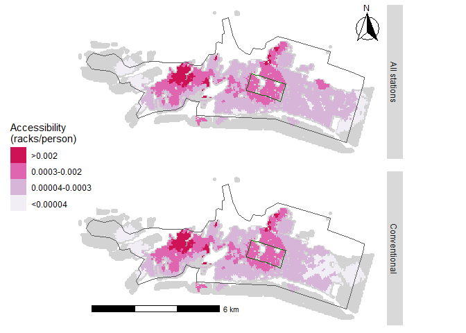

<!-- README.md is generated from README.Rmd. Please edit that file -->

# Examining spatial equity of bike share: A balanced floating catchment area approach

<!-- badges: start -->

<!-- badges: end -->

Elise Desjardins (McMaster University)  
Christopher D. Higgins (University of Toronto Scarborough)  
Antonio Páez (McMaster University)

Paper submitted to *Transportation Research Part D: Transport and
Environment*

## Abstract

Public bicycle share programs (PBSPs) can play a role in advancing
transportation equity if they make cycling more accessible to
disadvantaged populations. In Ontario, the City of Hamilton expanded
their PBSP in 2018 by adding twelve docking stations with the explicit
objective of increasing spatial equity in access. In this case study, we
investigate differentials in accessibility to stations using a balanced
floating catchment area accessibility approach and compare accessibility
with and without the equity stations. We analyze micro zones to better
reflect walking to a station and conduct a sensitivity analysis at
several walking time thresholds. We then reaggregate the estimated
accessibility for further analysis using census data. Our findings
indicate that equity stations increased the serviced population at every
threshold examined. Although accessibility increased for the whole
population, this increase was relatively modest especially for
population in the bottom 20% of median total household income.

## Keywords

  - Public Bike Sharing Programs  
  - Transport equity  
  - Horizontal equity  
  - Vertical equity  
  - Accessibility  
  - Balanced floating catchment areas  
  - Hamilton  
  - Ontario
  - Reproducible research

## Introduction

The potential of public bicycle share programs (PBSPs) to increase
cycling levels is but one of many reasons for implementing such programs
in urban areas (Hosford et al. 2018, 2019). As a healthy, inexpensive,
and convenient form of public transportation, shared bicycles can
encourage individuals to take up cycling for short local trips or first
and last mile trips to other public transportation instead of using
personal vehicles. These programs can also play a role in addressing
transportation needs and advancing transportation equity if they make
cycling more accessible to individuals and groups with lower
socioeconomic status. As these programs become increasingly common,
their introduction has been accompanied by a flurry of research that
investigates them from the perspective of spatial and transportation
equity (e.g., Hosford and Winters 2018; Mooney et al. 2019; Hull Grasso,
Barnes, and Chavis 2020; Qian and Jaller 2020, 2021; Smith, Oh, and Lei
2015). Indeed, although these programs are available to the general
public and ought to be accessible to any individual who wishes to use
them, research on PBSPs located in North American and European cities
indicates that inequity in spatial accessibility needs redressing.

In this paper, we investigate the case of the PBSP in the city of
Hamilton, in Ontario, Canada. Hamilton Bike Share was launched in 2015
and currently has over 900 operational bicycles and 130 docking
stations. An interesting feature of this program is that it was expanded
by an equity initiative that introduced twelve stations in 2018 with the
explicit objective of increasing spatial accessibility. Hamilton Bike
Share was already studied by Hosford and Winters (2018) as part of a
selection of PBSPs in Canada. The authors found that most of the cities
in their research could benefit of greater efforts to expand service to
areas with lower socioeconomic groups - but Hamilton fared somewhat
better than other cities in this respect. What distinguishes our
research from existing literature is the use of a balanced floating
catchment area (BFCA) accessibility approach that accounts for the
supply of stations and the potential demand from the population
serviced. This requires a more disaggregated approach than the use of
census geographies (q.v., Hosford and Winters 2018), since walking trips
to a bicycle share station likely happen at a level lower than even the
smallest census geography. For this reason, we implement our analysis
parting from micro population zones to better reflect the friction of
walking to a docking station, which is an important component of a bike
share trip (Chen et al. 2019). Further, we conduct a sensitivity
analysis at several walking time thresholds. In terms of spatial equity,
we compare accessibility with and without the equity stations to assess
the effect of the initiative, before reaggregating the data for further
analysis using median total household income information from the
census.

This paper is an example of open and reproducible research that uses
only open software for transportation and statistical analysis (R. S.
Bivand 2020; Lovelace 2021). All data were obtained from publicly
available sources and organized in the form of a data package. Following
best practices in spatial data science (Brunsdon and Comber 2020), the
code and data needed to reproduce, modify or extend the analysis are
available for download.\[1\]

## Literature Review

Public bicycle share programs have been implemented in over 800 cities
worldwide and a great deal has been learned about their typical users
(Fishman 2016). In many cities, males use bike share more than females
(Brey, Castillo-Manzano, and Castro-Nuño 2017; Nickkar et al. 2019;
Ogilvie and Goodman 2012; Reilly, Wang, and Crossa 2020; Winters,
Hosford, and Javaheri 2019) as do younger age cohorts (Brey,
Castillo-Manzano, and Castro-Nuño 2017; Buck et al. 2013; Fuller et al.
2011). However, one study found that bike share users in Washington, DC
were more likely to be female (Buck et al. 2013), which suggests that
the gender gap among cyclists who use bike share is less disparate than
the gap for personal bicycle use (Fishman 2016). There is some evidence
that bike share users are less likely to own a car (Buck et al. 2013;
Reilly, Noyes, and Crossa 2020). However, the relationship between
income or education and bike share use is less clear-cut. Stations in
disadvantaged communities in Chicago have been found to generate most of
the average annual trips (Qian and Jaller 2020) and individuals from
minority or lower socioeconomic status neighborhoods in
Minneapolis-St. Paul used the city’s PBSP more (J. Wang and Lindsey
2019b). Similar findings were reported in London (Ogilvie and Goodman
2012). Being university educated was a significant correlate of bike
share use in Montreal, Canada (Fuller et al. 2011). Perhaps not
coincidentally, financial savings have been found to motivate those on a
low income to use bike share (Fishman 2016).

Many studies have found that geographic proximity to a bicycle share
station is an important determinant of membership and use (Fishman 2016;
Fuller et al. 2011). This makes sense given that individuals are more
likely to use services or programs that they can easily reach. Several
studies have recently explored the equity of PBSPs in North America by
primarily examining who has access to bike share (e.g., differences by
demographics or socioeconomic status) and where stations are located. It
is important to note that equity can be achieved in two different ways:
balanced or equal spatial distribution across a region for all similar
groups (e.g., horizontal equity) or greater and targeted access to
accommodate vulnerable or disadvantaged populations (e.g., vertical
equity) (see Chen et al. 2019). Both are of interest to researchers and
transportation planners since they are often linked in that advantage,
or conversely disadvantage, has spatial patterns. Using a negative
binomial regression model, Qian and Jaller (2020) estimated ridership in
Chicago’s PBSP and found some disparities. A minority of bike share
stations were found to be located in disadvantaged communities, while
annual members from disadvantaged communities have a lower share of
trips compared to other areas in the city. This suggests that they may
be using PBSPs for utilitarian trips (e.g., commuting), which points to
the importance of ensuring equitable access (Qian and Jaller 2020).
Similar results were found in Philadelphia. Despite efforts to increase
equity within the city’s PBSP, census block groups with lower median
income generated fewer trips which suggested that efforts have not been
as successful as intended (Caspi and Noland 2019). Trips from stations
in such areas are utilitarian (e.g., commuting to work), which points to
the importance of ensuring equitable access (Caspi and Noland 2019). In
the case of Seattle, all neighborhoods had some level of access to
dockless bicycles but those with higher incomes and more residents of
higher education had more bikes (Mooney et al. 2019). Babagoli et
al. (2019) also found that neighborhoods in New York City with higher
affluence had the greatest proportion of Citi Bike stations.

On the whole, existing studies highlight the need for PBSPs to be more
highly accessible for diverse populations in order to increase use
beyond the “typical” users. This has been the focus of recent research
(see, among others, Auchincloss et al. 2020; Hull Grasso, Barnes, and
Chavis 2020; MacArthur et al. 2020). Offering more people the option of
using sustainable and active transportation, particularly those who have
lower socioeconomic status and might benefit the most, is a worthy
policy goal for cities with PBSPs. A few North American cities have
launched specific programs to address barriers to bike share or to
expand service to more deprived areas: Philadelphia, Pennsylvania (Caspi
and Noland 2019), and Hamilton, Ontario (Hosford and Winters 2018).
However, exploring transportation equity by investigating where bicycle
share stations are located, often using neighborhoods or census tracts
as the geographical unit of analysis, can ignore or miss the benefits
that may be derived from adjacent zones. Meaning that, stations may be
lacking in certain neighborhoods but there may be stations accessible
within a reasonable walking time. This is where geographical
accessibility becomes an important consideration.

Accessibility has been applied in both a positive and normative way to
inform transportation planning (Páez, Scott, and Morency 2012), but its
utility to this field has evolved over the past century and has
increasingly become linked with recent planning interests in
prioritizing modes that are suitable for local trips like walking and
cycling (Levine 2020). As a measure of the ease of reaching potential
destinations spread spatially in a given area, accessibility is relevant
to PBSPs because it can identify current inequality in the provision of
infrastructure, as well as guide interventions that increase access for
groups that are under-serviced or address gaps in transportation
options. It also addresses some of the challenges of other performance
measures such as level of service within a transportation network by
measuring person-based indicators and exploring differences in use
between population groups (Páez, Scott, and Morency 2012).

Beyond the utility derived from using shared bikes to destinations of
value, an important aspect of accessibility associated with PBSPs is the
distance an individual must travel to reach a bicycle share station
(Kabra, Belavina, and Girotra 2020; J. Wang and Lindsey 2019a). Since
the time or distance needed to reach a bicycle share station decreases
the potential of accessing the program and ultimately their use of the
program, the location and size (e.g., number of bicycle racks) of
stations matters. Indeed, distance to bicycle share stations is
associated with use (Fuller et al. 2011; J. Wang and Lindsey 2019a) and
can be a barrier to using PBSPs (Fishman et al. 2014). Kabra et
al. (2020) found that the majority of bike share usage in Paris comes
from areas within 300 m of stations, which amounts to 2-4 minutes
walking by an able-bodied adult. Furthermore, similar to other public
amenities affected by crowding, like health care services (e.g.,
Pereira, Braga, et al. 2021), the utility of stations is limited by the
*maximum* number of bicycles that they can hold. The program may not
necessarily be improved if stations are easy to reach but offer only a
small number of bicycles. Likewise, more people may not opt to use the
program if the supply of bicycles available at nearby stations is
insufficient to meet demand. The location and size of stations is
important to increase the utility of this public transportation option
for more people, thus achieving vertical equity. Accessibility analyses
for PBSPs constitute a positive and evaluation-based approach that also
has the potential to inform equity efforts. For instance, Wang and
Lindsey (2019a) investigated whether new or relocated bicycle share
stations increased accessibility and use, which offered important
insights to improve the performance of the program.

Several approaches have been commonly used for measuring place-based
accessibility, including cumulative opportunities, gravity, and
utility-based measures (Handy and Niemeier 1997). Geurs and Van Wee
(2004) and Paez et al. (2012) provide recent overviews of various
formulations and applications of accessibility in transportation
research. The common gravity-based approach for example involves
weighting destination opportunities, such as the quantity of bicycle
share stations, by the time required to reach them from an origin using
an impedance function (Handy and Niemeier 1997; Kwan 1998). However,
while such measures are suitable for capturing the potential for
reaching destinations from a given location, they do not take demand or
congestion effects into account.

In contrast, floating catchment area (FCA) methods incorporate
information on capacity and demand in calculating accessibility. FCA
measures have been widely employed in healthcare accessibility research
and are typically calculated across two steps. In the first, a ratio of
supply to demand at service locations is calculated, such as the number
of beds at a hospital divided by the number of people within the
catchment area of the hospital, weighted by the distance involved in
reaching the facility. Next, these service level ratios are allocated
back to the population centers and summarized as a measure of congested
accessibility. Thus, this model does a good job of considering potential
crowding or competition for services. While there have been many
methodological innovations in FCA methods (for example, Delamater 2013;
Luo and Wang 2003; Luo and Qi 2009; Radke and Mu 2000; Wan, Zou, and
Sternberg 2012), a recent improvement to this approach was achieved
through a simple and intuitive balancing of the impedance that addressed
the effects of demand and service inflation found in earlier FCA
approaches (see Paez, Higgins, and Vivona 2019).

When measuring accessibility, researchers have taken different
approaches when it comes to aggregation of data, either by using the
individual or household as the smallest unit of analysis or larger
spatial zones. Previous research on bike share equity has typically used
a meso- or macro-level approach with aggregated data from entire
neighborhoods or census tracts (Babagoli et al. 2019; Mooney et al.
2019; Qian and Jaller 2020; J. Wang and Lindsey 2019b), although there
are recent exceptions (Chen et al. 2019; Chen and Li 2021). This is also
true for studies examining correlates of bike share demand (J. Wang and
Lindsey 2019a). Handy and Niemeier (1997) note that using disaggregated
data in accessibility analyses provides a more accurate estimate for
individuals, which is useful for addressing vertical inequity in PBSP
usage. Chen et al. (2019, 530) are in favour of using disaggregated
data, which they did in their recent analysis of Tampa’s PBSP, because
they note “the use of aggregated data might hinder our understanding of
the equity impacts since individual disparities are absorbed after
aggregation”.

Using the balanced floating catchment area method (Paez, Higgins, and
Vivona 2019), a novel approach that has not been used yet in cycling
research, with disaggregated population data, we examine accessibility
to a public bicycle share program in Hamilton, Ontario. In this paper,
we (1) conduct a sensitivity analysis by measuring accessibility and
level of service to bicycle share stations at different walking time
thresholds to reach a station: 3 minutes, 5 minutes, 10 minutes, and 15
minutes; (2) explore the contribution of specific stations that were
added to Hamilton’s PBSP to reducing both horizontal and vertical
inequities; and (3) examine whether disparities in accessibility exist
according to median total household income of dissemination areas within
the core service area.

## Case Study

### Original System

The focus of this study is the city of Hamilton, located in Ontario,
Canada. The city launched a public bicycle share program in March 2015
with 115 stations and 750 bicycles (Hamilton 2015b). Before June 2020,
the program was known as Social Bicycles or SoBi Hamilton, but is now
called Hamilton Bike Share. Stations are spaced between 300 and 600 m
apart (Scott, Lu, and Brown 2021). The core service area spans 40 sq.km
of the city although it was planned to be 20 sq.km (Hamilton 2015a), and
roughly 138,000 people are within 30 minutes walking of a bike share
station \[see Figure \]. This represents roughly one fifth of the total
population of the Hamilton Census Metropolitan Area according to the
2016 Canadian Census. The City of Hamilton undertook a large public
engagement campaign to validate the locations of bicycle share stations
that had been selected and to crowdsource potential locations for
additional locations (Hamilton 2014). Most of the suggested locations
were in the east end of the core service area that lack stations or in
neighborhoods not serviced by the PBSP. The program was enthusiastically
welcomed in the city in 2015 - within three weeks of launching, 10,000
trips had been made (Hamilton 2015b), however inadequate coverage given
the size of Hamilton Bike Share’s service area was identified as a
problem early on, and transportation planners noted that the small size
(i.e., supply of bicycle racks) and low quantity of stations would lead
to challenges in balancing the system (Hamilton 2015a). Based on public
feedback, thirteen stations were added to the original system.

### Equity Initiative

In 2017, Hamilton Bike Share Inc., the non-profit organization that
operates the program, initiated an equity program, Everyone Rides
Initiative (ERI), with the objective of reducing barriers that may
prevent individuals from accessing bike share in Hamilton. Additional
bicycles and stations were added to the program which expanded it to
more disadvantaged areas in the core service area. The program also
offers subsidized memberships to individuals who identify as low income,
and complements this service with cycle skills education. A comparable
program can be found in Philadelphia (see Caspi and Noland 2019).

### Current System

As of June 2020, Hamilton Bike Share has 900 bikes, 130 stations \[see
Figure \], and over 26,000 active memberships (Hamilton 2015b). The core
service area remains 40 sq.km. The PBSP has twelve stations that were
added as part of the ERI initiative; we refer to these as “equity
stations” throughout the paper while all other stations are
“conventional stations”. In total, 118 stations are “conventional” and
12 are “equity”.

### Membership

Hamilton Bike Share conducted one membership survey in 2018 (Civicplan
2017) and the findings from 420 members are broadly in line with the
trends that were discussed above (see Fishman 2016 for a recent review
of the literature). The majority of respondents live within the core
service area and the gender split is expected: 57% of respondents are
male and 41% are female. The majority of respondents, both male and
female, are between 25 and 34 years of age, but the percentage of male
respondents is higher in the subsequent age groups. Respondents use bike
share for commuting (40% of trips) or errands and meetings (24% of
trips) and nearly 50% of trips have an average length of 11 to 20
minutes. As a result of having a bike share membership, 49% of
respondents report that they use their private vehicle less often or
much less often but 48% report that their private vehicle use has
remained about the same. This suggests that Hamilton Bike Share has been
useful for certain kinds of trips but not all, meaning that some trips
continue to require a personal vehicle.

### Relevant Research

Our analysis builds upon a previous and recent study (Hosford and
Winters 2018), which found that areas in Hamilton with less advantage
are better served by the city’s PBSP compared to other Canadian cities
\[i.e., Toronto, Vancouver, Montreal, and Ottawa-Gatineau\] where areas
that are less deprived have greater access. Hosford and Winters (2018)
acknowledge that “Hamilton stands out in that the lower income
neighborhoods are located near the city center and wealthier
neighborhoods are in the surrounding suburban areas”. Therefore, the
core service area for the PBSP in Hamilton by default covers some of the
less advantaged areas in the city. However, there is also a great deal
of variation in income in the city center because of the local
university and increasing gentrification. Hosford and Winters (2018)
took a macro-level and system-wide approach in their analysis by using
dissemination areas *across* the city as the unit of analysis. They did
not focus specifically on the core service area and did not
differentiate between conventional and equity stations.

The core service area of Hamilton Bike Share is outlined in black.
Hamilton Census Metropolitan Area is shown in grey.

The spatial distribution of bicycle share stations in Hamilton, Ontario.
The service area of Hamilton Bike Share is outlined in black and the
city’s downtown core is outlined in pink. Hamilton Census Metropolitan
Area is shown in grey.

## Methods and Data

### Floating Catchment Area

Floating catchment area (FCA) methods are an approach commonly used in
the healthcare accessibility literature. This approach is more
appropriate and informative than calculating provider-to-population
ratios (PPR) that simply divide the level of supply of a service (e.g.,
the number of bicycle racks at a station) by the population who have
access to the service (Paez, Higgins, and Vivona 2019). In particular,
the Two-Step Floating Catchment Area (2SFCA) method (Luo and Wang 2003;
Radke and Mu 2000) produces flexible catchment areas instead of using
rigid boundaries like PPR. This provides more useful information because
it does not assume that people are limited to service within pre-defined
boundaries (Paez, Higgins, and Vivona 2019). This is an important
property that supports our rationale for applying this method to measure
accessibility to Hamilton Bike Share. The City of Hamilton has
positioned stations between 300 and 600 m apart, but anticipates that
hubs will service those living within a 250 m buffer from the station
(Hamilton 2015a). The latter constitutes a normative statement: people
ought to be able to access a station in less than 600 m if they live in
the core service area, with usage coming from 250 m around. However, it
is not known how far people are actually willing to travel to reach a
station. It would be reasonable to assume that people are willing to
walk beyond this threshold to access other stations if the ones nearest
them have no supply of bicycles.

More recently, the *balanced* floating catchment area approach was
developed to address issues with demand and supply inflation that result
from the overlapping catchment areas produced by earlier FCA methods
(Paez, Higgins, and Vivona 2019). Briefly, overlapping catchment areas
lead to inflation of population totals and deflation of service levels
across a study area and generates inaccurate or misleading accessibility
estimates. In contrast, Paez et al. (2019) adjusted the impedance
weights so that both supply and demand are proportionally allocated. The
result is a FCA method that balances the population and level of service
by eliminating the over-counting of population and level of service that
leads to distortions in demand and supply. Other benefits of this
adjusted method include consideration of competition which can occur
when catchment areas overlap, as well as the preservation of population
and level of service. Balanced floating catchment area methods have been
used to explore accessibility to health care providers (Paez, Higgins,
and Vivona 2019) and COVID-19 health care services (Pereira, Braga, et
al. 2021), but have not yet been used in the cycling literature to
explore issues of accessibility.

The first step in the floating catchment area method is to allocate the
population to be serviced by each Hamilton Bike Share station:   
  

As seen in the equation above, the population allocated to station
 is the weighted sum of
the population in the region; a spatial weight

represents the friction that the population at
 faces when reaching
station , and is usually
given by a distance-decay function, so that each station is assumed to
service only a segment of the population within a limited geographical
range.

Next, the supply at each station (i.e., the maximum number of bicycle
racks) is divided by its estimated service population within the
established catchment area; this gives the level of service of station
 in bicycle racks per
person:   
  

Finally, the accessibility of population cell
 is calculated as the
weighted sum of the level of service of all stations that can be reached
from there according to the spatial weights:   
  

The balanced approach of Paez et al (2019) replaces the spatial weights
with normalized versions as follows:   
  

and:   
  

These weights satisfy the following properties:   
  

and:   
  

With these weights, accessibility can be calculated without risk of
demand or supply inflation:   
  

By allocating the population and level of service proportionally, this
method preserves the values of the population and level of service and
provides a regional provider-to-population ratio since:   
  

In fact, since the proportional allocation procedure means that any
proportion of the population allocated to a station is never allocated
to other stations, and conversely any level of service allocated to a
population is never re-allocated elsewhere, this property is replicated
for any level of aggregation. For this paper, we employ a hybrid
location-based and person-based approach to calculating accessibility
using disaggregated population data. In their review of accessibility
measures, Geurs and van Wee (2004) highlight the need for greater
inclusion of individual spatio-temporal constraints but acknowledge the
challenges of acquiring and analyzing person-based data. This comes
after Kwan’s (1998) work to show that space-time measures are better
able of capturing interpersonal differences, especially the effect of
space-time constraints on individual behaviour, and are more helpful for
unraveling gender/ethnic differences. Applying the balanced floating
catchment area approach allows us to examine accessibility by
stratifying according to median total household income, which
constitutes the individual component of the accessibility measure (Geurs
and van Wee 2004). However, conducting a further sensitivity analysis to
measure accessibility at different walking time thresholds would help to
consider potential spatio-temporal constraints. Different people may be
willing to travel different distances to access a public bicycle share
station.

### Pycnophylactic Interpolation

To obtain population at sub-census geography levels (at the micro
scale), we use pycnophylactic interpolation (Tobler 1979). We obtained
population data from the 2016 Census of Canada for dissemination areas
(DA), which is the smallest publicly available census geography in
Canada. These zonal values of the population were interpolated to
smaller polygons 50-by-50 m in size. Pycnophylactic interpolation
involves smoothing out the population from each dissemination area while
preserving total volume \[see Figure \]. When interpolating the
population at this high level of resolution, it is important to ensure
that population numbers were not allocated to areas where people do not
live in Hamilton (for example, to parks, large institutional buildings,
etc.). To do so, we retrieved shapefiles for various geographic features
\[see Table \] from Open Hamilton. Next, we removed these features from
the PBSP core service area and used pycnophylactic interpolation to
disaggregate and reallocate population within the remaining area \[see
Figure \].

<table class=" lightable-paper table" style='font-family: "Arial Narrow", arial, helvetica, sans-serif; width: auto !important; margin-left: auto; margin-right: auto; margin-left: auto; margin-right: auto;'>

<caption>

Landscape features extracted from the Hamilton Bike Share core service
area before population is interpolated.

</caption>

<thead>

<tr>

<th style="text-align:left;">

Feature

</th>

<th style="text-align:left;">

Description

</th>

</tr>

</thead>

<tbody>

<tr>

<td style="text-align:left;font-weight: bold;border-right:1px solid;">

Hamilton Bike Share Stations

</td>

<td style="text-align:left;width: 30em; ">

The location of stations and the number of racks available at each
station.

</td>

</tr>

<tr>

<td style="text-align:left;font-weight: bold;border-right:1px solid;">

Golf Courses

</td>

<td style="text-align:left;width: 30em; ">

The location of City and privately owned golf courses.

</td>

</tr>

<tr>

<td style="text-align:left;font-weight: bold;border-right:1px solid;">

Parks

</td>

<td style="text-align:left;width: 30em; ">

The location of parks and other green spaces.

</td>

</tr>

<tr>

<td style="text-align:left;font-weight: bold;border-right:1px solid;">

Designated Large Employment Areas

</td>

<td style="text-align:left;width: 30em; ">

The location of large business parks and industrial lands.

</td>

</tr>

<tr>

<td style="text-align:left;font-weight: bold;border-right:1px solid;">

Municipal Parking Lots

</td>

<td style="text-align:left;width: 30em; ">

The location of municipal car parks.

</td>

</tr>

<tr>

<td style="text-align:left;font-weight: bold;border-right:1px solid;">

Cemeteries

</td>

<td style="text-align:left;width: 30em; ">

The location of cemeteries.

</td>

</tr>

<tr>

<td style="text-align:left;font-weight: bold;border-right:1px solid;">

Environmentally Sensitive Areas

</td>

<td style="text-align:left;width: 30em; ">

The location of either land or water areas containing natural features
or significant ecological functions.

</td>

</tr>

<tr>

<td style="text-align:left;font-weight: bold;border-right:1px solid;">

Streets

</td>

<td style="text-align:left;width: 30em; ">

The street network in Hamilton, including road classification for
highways.

</td>

</tr>

<tr>

<td style="text-align:left;font-weight: bold;border-right:1px solid;">

Educational Institutions

</td>

<td style="text-align:left;width: 30em; ">

The location of all educational institutions and schools.

</td>

</tr>

<tr>

<td style="text-align:left;font-weight: bold;border-right:1px solid;">

Places of Worship

</td>

<td style="text-align:left;width: 30em; ">

The location of buildings used for religious congregations.

</td>

</tr>

<tr>

<td style="text-align:left;font-weight: bold;border-right:1px solid;">

Municipal Service Centers

</td>

<td style="text-align:left;width: 30em; ">

The location of all municipal service centers, including City Hall.

</td>

</tr>

<tr>

<td style="text-align:left;font-weight: bold;border-right:1px solid;">

Recreation and Community Centers

</td>

<td style="text-align:left;width: 30em; ">

The location of all recreation and community centers.

</td>

</tr>

<tr>

<td style="text-align:left;font-weight: bold;border-right:1px solid;">

Arenas

</td>

<td style="text-align:left;width: 30em; ">

The location of all indoor arenas.

</td>

</tr>

<tr>

<td style="text-align:left;font-weight: bold;border-right:1px solid;">

Emergency Stations

</td>

<td style="text-align:left;width: 30em; ">

The location of all Emergency Management Services (EMS) Ambulance
stations.

</td>

</tr>

<tr>

<td style="text-align:left;font-weight: bold;border-right:1px solid;">

Fire Stations

</td>

<td style="text-align:left;width: 30em; ">

The location of all fire stations.

</td>

</tr>

<tr>

<td style="text-align:left;font-weight: bold;border-right:1px solid;">

Police Stations

</td>

<td style="text-align:left;width: 30em; ">

The location of all police stations.

</td>

</tr>

<tr>

<td style="text-align:left;font-weight: bold;border-right:1px solid;">

Railways

</td>

<td style="text-align:left;width: 30em; ">

The railway network in Hamilton.

</td>

</tr>

<tr>

<td style="text-align:left;font-weight: bold;border-right:1px solid;">

Hospitals

</td>

<td style="text-align:left;width: 30em; ">

The location of all hospitals.

</td>

</tr>

</tbody>

</table>

Population in all dissemination areas (outlined in white) that are
inside or touch the bounding box of the Hamilton Bike Share core service
area (outlined in black).

Interpolated population in the Hamilton Bike Share’s core service area
(outlined in black) and within 30 minutes of walking to the core service
area. Each population cell is 50-by-50 m in size. The downtown area is
outlined in dark green.

### Travel Time Matrix

To calculate walking times from the centroid of our micro population
cells, we extracted OpenStreetMap data for Hamilton Bike Share’s service
area from [BBBike](https://download.bbbike.org/osm/bbbike/), an online
cycle route planner that interfaces with OpenStreetMap. OpenStreetMap
data provides the networks for calculating walking times from each
population cell to nearby bicycle share stations, using a maximum
walking distance of 10 km and walking time of 30 minutes as thresholds.
A travel time matrix was created with the origins as the coordinates of
the population cells and the destinations as the coordinates of the
bicycle share stations within the maximum threshold. This process
provides a more realistic measure of the friction of reaching stations
by taking infrastructure into account of travel times, rather than using
the Euclidean distance from population cell to station. Routing and
travel time calculations were completed using the `R` package `r5r`,
used for rapid realistic routing operations (Pereira, Saraiva, et al.
2021).

### Data

All data for this research were accessed from publicly available Census
of Canada sources, from OpenStreetMaps, and from Open Hamilton\[2\], a
public online repository of data curated by the City of Hamilton.

## Results

### Accessibility by Distance Thresholds

Consensus regarding the distance that individuals are willing to walk to
access a bicycle share station is lacking, but the literature on walking
behaviour can provide some guidelines to determine the thresholds for
sensitivity analysis. Previous studies have found that living within 250
m (Fuller et al. 2011) and 300 m (Kabra, Belavina, and Girotra 2020) is
correlated with bike share use, while other research has found that
walking trips are less than 600 m and rarely more than 1200 m (Millward,
Spinney, and Scott 2013) or a median distance of 650 m (Larsen,
El-Geneidy, and Yasmin 2010). In Hamilton, Hamilton Bike Share will
depict a map at some stations to show the user the locations of the
other nearest stations within a five minute walk, which suggests that
this is an average distance that people are expected to walk. National
Association of City Transportation Officials (NACTO) has a similar
normative guide (City Transportation Officials 2015).

In the present case, we found that congested accessibility calculated
using the balanced FCA approach increases with a threshold between two
and four minutes, but is then maximized at 5 minutes. Accessibility
decreases substantially after eight minutes, which is intuitive given
that demand on a limited supply increases as more people can reach each
station.

For this reason, we experiment with various thresholds by conducting a
sensitivity analysis to calculate accessibility at different walking
times from population cell to bicycle share station: 3 minutes, 5
minutes, 10 minutes, and 15 minutes. We categorize these thresholds as
minimum, average, maximum, and extreme, respectively. At each threshold,
we compare accessibility between the current system and the original
system to examine the contribution of the additional equity stations.
When considering the results reported below, it is important to remember
that accessibility is technically a form of smoothing (O’Kelly and
Horner 2003, 7–8): smaller thresholds produce less smoothing (which can
result in “spiky” accessibility landscapes), while larger thresholds
produce more smoothing and fewer spikes.

<!-- Calculate accessibility for different thresholds -->

#### Minimum Threshold

With a walking distance of three minutes, we find that there are 25.2
bicycle racks per person system-wide in the original system
configuration (i.e., without equity stations). The addition of equity
stations increases this ratio slightly to 25.4 bicycles per person.
Figure  presents a comparison of accessibility between the systems for
the population cells. Accessibility is fairly uniform overall, with the
exception of two small areas where accessibility is slightly higher.
This high level of system-wide accessibility occurs because the
population that can reach bicycle share stations when travel time is 3
minutes or less is very limited, and accessibility is strongly shaped by
a few locations that concentrate population and stations.

Accessibility at 3 minutes walk (minimum threshold) compared between
current system with equity stations and the original system without
equity stations.

#### Average Threshold

With a walking distance of five minutes, we find that there are 68.6
bicycle racks per person system-wide in the original system
configuration (i.e., without equity stations). With the addition of
equity stations, there are now 68.8 bicycle racks per person. At this
threshold, there are more bicycle racks per person than at the minimum
threshold. System-wide accessibility has in fact increased: the
population that can reach the stations has grown, but not to the the
point that congestion effects begin to take place. Figure  presents a
comparison of accessibility between the systems. Again, accessibility is
fairly uniform, with the exception of one very small area.

Accessibility at 5 minutes walk (average threshold) compared between
current system with equity stations and the original system without
equity stations.

#### Maximum Threshold

With a walking distance of ten minutes, we find that there are 3.61
bicycle racks per person system-wide in the original system
configuration (i.e., without equity stations). With the addition of
equity stations, there are now 3.74 bicycles per person. Figure 
presents a comparison of accessibility between the systems. Differences
in accessibility across the service area are now apparent, with users
near the university and its adjacent neighborhoods, as well as
neighborhoods north of the downtown area (the latter is outlined in
green), having slightly higher accessibility. While the differences are
modest, they are more apparent at this threshold than at shorter walking
distances.

Accessibility at 10 minutes walk (maximum threshold) compared between
current system with equity stations and the original system without
equity stations.

#### Extreme Threshold

With a walking distance of fifteen minutes, we find that there are 2.44
bicycle racks per person system-wide in the original system
configuration (i.e., without equity stations). With the addition of
equity stations, there are now 2.55 bicycles per person. Figure 
presents a comparison of accessibility between the systems. Users near
the university and the neighborhoods north of the downtown area (the
latter is outlined in green) have the highest accessibility, followed by
those who live in the city’s downtown area. Accessibility in the east
end, where equity stations were implemented, of the core service area
remains low.

Accessibility at 15 minutes walk (extreme threshold) compared between
current system with equity stations and the original system without
equity stations.

### Accessibility by Median Total Household Income

A unique property of the balanced floating catchment area method is that
data can be reaggregated while preserving the total population in the
service area and the supply at each station. This avoids demand and
supply inflation, and also enables us to present findings in a way that
is perhaps more intuitive to interpret. Therefore, we reaggregate
population and accessibility from the 50-by-50 m population cells to the
dissemination area. We then can compare accessibility to median total
household income statistics from the Canadian census results from 2016.

Figures 1 \[\], 2 \[\], 3 \[\], and 4 \[\] depict bivariate choropleth
maps that combine the spatial distribution of accessibility and median
total household income, using tertiles for the coloring scheme. In each
figure, the top panel is the system without the equity stations (i.e.,
the original system configuration), and the bottom panel is
accessibility in the current system with equity stations. As expected,
the analysis indicates that the extreme threshold of fifteen minutes is
associated with the largest number of people who are within the assumed
service area of stations. We find that stations added to Hamilton’s
public bicycle share program did indeed expand the spatial coverage of
the system, leading to more balance across the service area. By
implementing equity stations in areas with lower median total household
income in Hamilton, the PBSP attained greater horizontal equity by
extending the spatial distribution of bicycles across the city. This is
particularly evident at the minimum and average thresholds of three and
five minutes, respectively, where the equity stations fill a number of
gaps in program coverage.

Bivariate map of accessibility and income (threshold: 3 min): without
equity stations (top panel) and with equity stations (bottom panel)

Bivariate map of accessibility and income (threshold: 5 min): without
equity stations (top panel) and with equity stations (bottom panel)

Bivariate map of accessibility and income (threshold: 10 min): without
equity stations (top panel) and with equity stations (bottom panel)

Bivariate map of accessibility and income (threshold: 15 min): without
equity stations (top panel) and with equity stations (bottom panel)

To further explore this issue and examine vertical equity, we aggregate
accessibility by median total household income across all geographies
(see Table ). Similar to Hosford and Winters (2018), we find that
Hamilton’s PBSP already serviced a large proportion of the population in
the bottom and second quintiles of median total household income. This
may well be an artifact of the spatial socioeconomic and demographic
profile of Hamilton, where the most dense parts of the city (where a
PBSP is most easily launched) are also those with relatively lower
incomes. On the other hand, the levels of accessibility to Hamilton’s
PBSP are generally lower for populations in the bottom 20% of median
total household income, compared to populations in the top 20%.

The spatial mapping reveals that the addition of equity stations
increased horizontal equity by growing the population serviced
irrespective of the walking threshold. The largest gains were made for
dissemination areas in the second 20%, where an additional 3,073 and
5,395 people could reach a bicycle share station within three and five
minutes walk, respectively, after the addition of equity stations.
However, we find that there were only small increases in the population
in the bottom 20% of median total household income who are serviced by
the equity stations, and the accessibility gains are also quite modest
and smaller than for populations in the second and third quintiles of
median total household income. This suggests that income disparities
persist, albeit this depends on the walking time thresholds. With and
without equity stations, people in the top 20% of income have the
highest level of access at a threshold of ten and fifteen minutes.
Although dissemination areas in the second 20% have the highest level of
access by a significant amount at lower distance thresholds, the bottom
20%, who may benefit the most from Hamilton Bike Share’s equity
initiatives, have the lowest access at three minutes threshold and the
second lowest access at all other thresholds.

<table class="table" style="margin-left: auto; margin-right: auto;border-bottom: 0;">

<caption>

Accessibility and population serviced by income quintile and between
systems (with and without equity stations). Total population is the
population by income quintile in the DAs that have any PBSP service at
all.

</caption>

<thead>

<tr>

<th style="empty-cells: hide;border-bottom:hidden;" colspan="2">

</th>

<th style="border-bottom:hidden;padding-bottom:0; padding-left:3px;padding-right:3px;text-align: center; " colspan="2">

Without Equity Stations

</th>

<th style="border-bottom:hidden;padding-bottom:0; padding-left:3px;padding-right:3px;text-align: center; " colspan="2">

With Equity Stations

</th>

<th style="border-bottom:hidden;padding-bottom:0; padding-left:3px;padding-right:3px;text-align: center; " colspan="2">

Difference

</th>

</tr>

<tr>

<th style="text-align:left;">

Income Quintile

</th>

<th style="text-align:center;">

Total Population

</th>

<th style="text-align:center;">

Population

</th>

<th style="text-align:center;">

Accessibility

</th>

<th style="text-align:center;">

Population

</th>

<th style="text-align:center;">

Accessibility

</th>

<th style="text-align:center;">

Population

</th>

<th style="text-align:left;">

Accessibility

</th>

</tr>

</thead>

<tbody>

<tr grouplength="5">

<td colspan="8" style="background-color: #8f9498; color: #fff;">

<strong>Threshold - 3 minutes</strong>

</td>

</tr>

<tr>

<td style="text-align:left; padding-left:  2em;" indentlevel="1">

Bottom 20%

</td>

<td style="text-align:center;">

43441

</td>

<td style="text-align:center;">

22359

</td>

<td style="text-align:center;">

2.377

</td>

<td style="text-align:center;">

22798

</td>

<td style="text-align:center;">

2.424

</td>

<td style="text-align:center;">

439

</td>

<td style="text-align:left;">

0.047

</td>

</tr>

<tr>

<td style="text-align:left; padding-left:  2em;" indentlevel="1">

Second 20%

</td>

<td style="text-align:center;">

33312

</td>

<td style="text-align:center;">

9347

</td>

<td style="text-align:center;">

12.203

</td>

<td style="text-align:center;">

12420

</td>

<td style="text-align:center;">

12.281

</td>

<td style="text-align:center;">

3073

</td>

<td style="text-align:left;">

0.078

</td>

</tr>

<tr>

<td style="text-align:left; padding-left:  2em;" indentlevel="1">

Third 20%

</td>

<td style="text-align:center;">

30940

</td>

<td style="text-align:center;">

7745

</td>

<td style="text-align:center;">

3.093

</td>

<td style="text-align:center;">

9455

</td>

<td style="text-align:center;">

3.156

</td>

<td style="text-align:center;">

1710

</td>

<td style="text-align:left;">

0.063

</td>

</tr>

<tr>

<td style="text-align:left; padding-left:  2em;" indentlevel="1">

Fourth 20%

</td>

<td style="text-align:center;">

20185

</td>

<td style="text-align:center;">

1673

</td>

<td style="text-align:center;">

4.119

</td>

<td style="text-align:center;">

1673

</td>

<td style="text-align:center;">

4.119

</td>

<td style="text-align:center;">

0

</td>

<td style="text-align:left;">

0.000

</td>

</tr>

<tr>

<td style="text-align:left; padding-left:  2em;" indentlevel="1">

Top 20%

</td>

<td style="text-align:center;">

27541

</td>

<td style="text-align:center;">

2151

</td>

<td style="text-align:center;">

3.757

</td>

<td style="text-align:center;">

2416

</td>

<td style="text-align:center;">

3.784

</td>

<td style="text-align:center;">

265

</td>

<td style="text-align:left;">

0.027

</td>

</tr>

<tr grouplength="5">

<td colspan="8" style="background-color: #8f9498; color: #fff;">

<strong>Threshold - 5 minutes</strong>

</td>

</tr>

<tr>

<td style="text-align:left; padding-left:  2em;" indentlevel="1">

Bottom 20%

</td>

<td style="text-align:center;">

43441

</td>

<td style="text-align:center;">

35477

</td>

<td style="text-align:center;">

1.302

</td>

<td style="text-align:center;">

35803

</td>

<td style="text-align:center;">

1.357

</td>

<td style="text-align:center;">

326

</td>

<td style="text-align:left;">

0.055

</td>

</tr>

<tr>

<td style="text-align:left; padding-left:  2em;" indentlevel="1">

Second 20%

</td>

<td style="text-align:center;">

33312

</td>

<td style="text-align:center;">

17513

</td>

<td style="text-align:center;">

56.048

</td>

<td style="text-align:center;">

22908

</td>

<td style="text-align:center;">

56.137

</td>

<td style="text-align:center;">

5395

</td>

<td style="text-align:left;">

0.089

</td>

</tr>

<tr>

<td style="text-align:left; padding-left:  2em;" indentlevel="1">

Third 20%

</td>

<td style="text-align:center;">

30940

</td>

<td style="text-align:center;">

15117

</td>

<td style="text-align:center;">

4.259

</td>

<td style="text-align:center;">

18309

</td>

<td style="text-align:center;">

4.291

</td>

<td style="text-align:center;">

3192

</td>

<td style="text-align:left;">

0.032

</td>

</tr>

<tr>

<td style="text-align:left; padding-left:  2em;" indentlevel="1">

Fourth 20%

</td>

<td style="text-align:center;">

20185

</td>

<td style="text-align:center;">

2867

</td>

<td style="text-align:center;">

1.094

</td>

<td style="text-align:center;">

3116

</td>

<td style="text-align:center;">

1.095

</td>

<td style="text-align:center;">

249

</td>

<td style="text-align:left;">

0.001

</td>

</tr>

<tr>

<td style="text-align:left; padding-left:  2em;" indentlevel="1">

Top 20%

</td>

<td style="text-align:center;">

27541

</td>

<td style="text-align:center;">

4074

</td>

<td style="text-align:center;">

6.256

</td>

<td style="text-align:center;">

4540

</td>

<td style="text-align:center;">

6.264

</td>

<td style="text-align:center;">

466

</td>

<td style="text-align:left;">

0.008

</td>

</tr>

<tr grouplength="5">

<td colspan="8" style="background-color: #8f9498; color: #fff;">

<strong>Threshold - 10 minutes</strong>

</td>

</tr>

<tr>

<td style="text-align:left; padding-left:  2em;" indentlevel="1">

Bottom 20%

</td>

<td style="text-align:center;">

43441

</td>

<td style="text-align:center;">

41824

</td>

<td style="text-align:center;">

0.604

</td>

<td style="text-align:center;">

41981

</td>

<td style="text-align:center;">

0.622

</td>

<td style="text-align:center;">

157

</td>

<td style="text-align:left;">

0.018

</td>

</tr>

<tr>

<td style="text-align:left; padding-left:  2em;" indentlevel="1">

Second 20%

</td>

<td style="text-align:center;">

33312

</td>

<td style="text-align:center;">

27546

</td>

<td style="text-align:center;">

0.862

</td>

<td style="text-align:center;">

30503

</td>

<td style="text-align:center;">

0.929

</td>

<td style="text-align:center;">

2957

</td>

<td style="text-align:left;">

0.067

</td>

</tr>

<tr>

<td style="text-align:left; padding-left:  2em;" indentlevel="1">

Third 20%

</td>

<td style="text-align:center;">

30940

</td>

<td style="text-align:center;">

22394

</td>

<td style="text-align:center;">

0.776

</td>

<td style="text-align:center;">

25128

</td>

<td style="text-align:center;">

0.802

</td>

<td style="text-align:center;">

2734

</td>

<td style="text-align:left;">

0.026

</td>

</tr>

<tr>

<td style="text-align:left; padding-left:  2em;" indentlevel="1">

Fourth 20%

</td>

<td style="text-align:center;">

20185

</td>

<td style="text-align:center;">

4544

</td>

<td style="text-align:center;">

0.225

</td>

<td style="text-align:center;">

4989

</td>

<td style="text-align:center;">

0.227

</td>

<td style="text-align:center;">

445

</td>

<td style="text-align:left;">

0.002

</td>

</tr>

<tr>

<td style="text-align:left; padding-left:  2em;" indentlevel="1">

Top 20%

</td>

<td style="text-align:center;">

27541

</td>

<td style="text-align:center;">

7989

</td>

<td style="text-align:center;">

1.346

</td>

<td style="text-align:center;">

9078

</td>

<td style="text-align:center;">

1.348

</td>

<td style="text-align:center;">

1089

</td>

<td style="text-align:left;">

0.002

</td>

</tr>

<tr grouplength="5">

<td colspan="8" style="background-color: #8f9498; color: #fff;">

<strong>Threshold - 15 minutes</strong>

</td>

</tr>

<tr>

<td style="text-align:left; padding-left:  2em;" indentlevel="1">

Bottom 20%

</td>

<td style="text-align:center;">

43441

</td>

<td style="text-align:center;">

42208

</td>

<td style="text-align:center;">

0.536

</td>

<td style="text-align:center;">

42327

</td>

<td style="text-align:center;">

0.557

</td>

<td style="text-align:center;">

119

</td>

<td style="text-align:left;">

0.021

</td>

</tr>

<tr>

<td style="text-align:left; padding-left:  2em;" indentlevel="1">

Second 20%

</td>

<td style="text-align:center;">

33312

</td>

<td style="text-align:center;">

30507

</td>

<td style="text-align:center;">

0.555

</td>

<td style="text-align:center;">

31069

</td>

<td style="text-align:center;">

0.614

</td>

<td style="text-align:center;">

562

</td>

<td style="text-align:left;">

0.059

</td>

</tr>

<tr>

<td style="text-align:left; padding-left:  2em;" indentlevel="1">

Third 20%

</td>

<td style="text-align:center;">

30940

</td>

<td style="text-align:center;">

26108

</td>

<td style="text-align:center;">

0.554

</td>

<td style="text-align:center;">

26660

</td>

<td style="text-align:center;">

0.581

</td>

<td style="text-align:center;">

552

</td>

<td style="text-align:left;">

0.027

</td>

</tr>

<tr>

<td style="text-align:left; padding-left:  2em;" indentlevel="1">

Fourth 20%

</td>

<td style="text-align:center;">

20185

</td>

<td style="text-align:center;">

6312

</td>

<td style="text-align:center;">

0.093

</td>

<td style="text-align:center;">

7435

</td>

<td style="text-align:center;">

0.096

</td>

<td style="text-align:center;">

1123

</td>

<td style="text-align:left;">

0.003

</td>

</tr>

<tr>

<td style="text-align:left; padding-left:  2em;" indentlevel="1">

Top 20%

</td>

<td style="text-align:center;">

27541

</td>

<td style="text-align:center;">

10209

</td>

<td style="text-align:center;">

0.808

</td>

<td style="text-align:center;">

11089

</td>

<td style="text-align:center;">

0.811

</td>

<td style="text-align:center;">

880

</td>

<td style="text-align:left;">

0.003

</td>

</tr>

</tbody>

<tfoot>

<tr>

<td style="padding: 0; " colspan="100%">

Note: 

</td>

</tr>

<tr>

<td style="padding: 0; " colspan="100%">

</td>

</tr>

<tr>

<td style="padding: 0; " colspan="100%">

a With equity stations = Hamilton Bike Share current system
(118 conventional stations, 12 equity stations)

</td>

</tr>

<tr>

<td style="padding: 0; " colspan="100%">

b Without equity stations = Hamilton Bike Share original
system (118 conventional stations, no equity stations)

</td>

</tr>

</tfoot>

</table>

## Discussion

Using disaggregated data in this paper, we examined spatial equity and
accessibility to Hamilton Bike Share, with a particular focus on
assessing the contribution of the program’s equity stations. Use of a
balanced floating catchment area approach, combined with pycnophylactic
interpolation, enabled us to measure accessibility on a micro scale
which is a sensible approach to avoid the “absorption of disparities”,
as articulated by Chen et al. (2019). This differentiates our analysis
from similar papers exploring equity in PBSPs that use larger
geographical units of analysis or that focus on station location instead
of level of service. In this way, our paper has made contributions in a
positive way by applying an intuitive and useful approach to measure
accessibility to a PBSP, and in a normative way by serving to inform
future investments in cycle infrastructure for Hamilton Bike Share.

The sensitivity analysis revealed that accessibility to Hamilton Bike
Share stations is maximized at five minutes and decreases significantly
by eight minutes \[see Table \]. This reflects the normative guide
advertised on some bicycle share stations in Hamilton showing other
stations within a five minute walk, as well as the directive of NACTO
(City Transportation Officials 2015). We find that over 118,000 people
can access a bicycle share station within a 15 minute walk, which
represents roughly 85% of the total population in the core service area
\[see Table \]. At a minimum threshold of three minutes, too few people
can reach stations which leads to relatively high levels of service
since there is little crowding. However, accessibility is at its lowest
after eight minutes whereby congestion effects due to increased
potential demand kick in. The City of Hamilton has recognized from the
launch of the PBSP that substantially more stations and bicycles are
needed to service the area (Hamilton 2015a). With a service area of 40
sq.km, it is estimated that Hamilton should have between 380 and 440
stations instead of 130, and 1,500 bicycles instead of 900 (Hamilton
2015a). Reduced capacity within the system leads to gaps in coverage in
some areas of the city “with some areas not having the recommended
station density of 300m between stations or 10 stations per square km”
(Hamilton 2015a). This study illustrates the consequences of an
imbalanced system whereby levels of accessibility are not equitable
across income groups.

We found that equity stations increased horizontal equity in Hamilton’s
core service area. Figures , , , and  demonstrate how gaps in service
were filled by these additional stations. This indicates that more
individuals at all income quintiles can access Hamilton Bike Share,
which leads to a more balanced or equal program. In this respect, there
are some commonalities between the expansions of Hamilton Bike Share and
that of Citi Bike in New York. Babgoli et al. (2019) found a slight but
not statistically significant increase in the proportion of
neighborhoods with the highest levels of poverty with stations after the
Citi Bike expansion in 2015. Although the Citi Bike expansion was not
specifically driven by a desire to reduce inequity in access, 16% of
neighborhoods with the highest levels of poverty had stations compared
to 12% before. Similarly, with the addition of equity stations, there
were large gains in accessibility for the second 20% at the average
threshold, over 5,000 more people, but much smaller gains for the bottom
20% with only 326 more people.

Vertical inequity, however, persisted as evidenced by differences in
accessibility according to income quintile. While the addition of equity
stations seems to modestly increase accessibility for all income groups
at all thresholds, they did not increase accessibility substantially for
any single income group. Most importantly, individuals in the bottom 20%
of median total household income have the second lowest level of access
to Hamilton Bike Share at most thresholds (average, maximum, and
extreme). At the minimum threshold, the bottom 20% have the lowest level
of access. While previous research found that neighborhoods with more
disadvantage are better serviced by Hamilton Bike Share, the authors
used the Pampalon Deprivation Index to determine the level of
disadvantage for dissemination areas *across* the city not just within
the core service area (Hosford and Winters 2018). Instead, we use median
total household income for each dissemination area *within* the core
service area. We conclude that Hamilton’s PBSP, while by default located
in areas with more deprivation compared to other cities, has disparities
in accessibility between income groups. With equity stations, many areas
with low median total household income in the east end of the service
area continue to have low accessibility. At the maximum and extreme
thresholds, the top 20% have the highest level of access to Hamilton
Bike Share. These findings aligns with other studies from Tampa (Chen et
al. 2019) and Seattle (Mooney et al. 2019), which have found disparities
in station location or access to bicycles between levels of income and
education.

Based on our analysis, we identified specific areas that have both low
accessibility and low median total household income which would benefit
from an increased supply of public bicycles. These empirical findings
provide support to the City of Hamilton’s efforts to increase equity and
balance the system, and confirm that additional stations and bicycles
are needed to improve access not only for the bottom 20% but for all
income groups. Figures , , , and  highlight potential locations for new
equity stations to better accommodate groups with lower socioeconomic
status.

## Study Limitations

This paper did not examine or compare ridership data between
conventional and equity stations. Therefore, further research is needed
to determine whether the addition of equity stations encouraged more
cycling for low-income individuals living near them. Other studies have
specifically looked at differences in trip type, frequency, or length
among users from disadvantaged neighborhoods (Caspi and Noland 2019;
Qian and Jaller 2020; J. Wang and Lindsey 2019b), but our analysis is
limited by the lack of publicly available route and individual user data
to conduct similar analyses for Hamilton Bike Share.

An additional limitation is the lack of publicly available information
about the number of bicycles at each station. Hamilton Bike share works
to balance the number of bicycles across stations, but it is reasonable
to expect that the number of bicycles will not match exactly the number
of racks at every station. Ideally, instead of number of bicycle racks
as our measure of supply, we would have liked to use the average number
of bicycles at stations, perhaps at different times during the day or
different seasons. Should this data become available, it would be
worthwhile to revisit the question to examine how well operation of the
system (including balancing of bicycles across stations) works to
maintain the nominal levels of accessibility examined in this paper.

## Conclusion

The addition of specific equity stations to the public bicycle share
program in Hamilton, Ontario had the net effect of increasing
accessibility and reducing to some extent both horizontal and vertical
inequities. In particular, accessibility improved the most for those in
the second 20% median total household income at all thresholds, but the
gains were only modest for all income groups. Dissemination areas with
the bottom 20% had the lowest accessibility at three minutes, and second
lowest levels of accessibility at five, ten, and fifteen minutes.
Congestion effects were observed at higher thresholds, with
accessibility decreasing significantly once the catchment area is
increased to ten minutes walking.

Wang and Lindsey (2019a) have noted that there is a lack of research
that examines how bike share users’ behaviour changes as a result of
program changes to station locations or improvements in accessibility.
As such, a logical next step to this research is to examine whether
Hamilton Bike Share’s equity stations increased ridership or resulted in
new memberships in areas that were previously under-serviced. An
examination of the types of trips undertaken by residents in these areas
would also be informative, such as the study undertaken by Caspi and
Norland (2019) after bike share stations were implemented in low-income
Philadelphia neighborhoods. The bulk of cycling facilities that have
been built in Hamilton to date are located in the core service area near
the conventional stations. It would be worthwhile to explore the route
choice of bike share trips departing or ending at the equity stations
and to identify factors that specifically influence trips from these
stations, which would extend existing studies conducted by Scott and
colleagues (Lu, Scott, and Dalumpines 2018; Scott and Ciuro 2019; Scott,
Lu, and Brown 2021). This paper, combined with additional studies such
as those conceptualized above, would serve as a valuable case study for
Hamilton and other cities with PBSPs that wish to evaluate and address
spatial inequality in accessibility and transportation options in urban
areas.

## Acknowledgments

This research was completed using open software, and the authors wish to
acknowledge the developers of the following `R` packages: `biscale`
(Prener, Grossenbacher, and Zehr 2020), `cowplot` (Wilke 2020),
`data.table` (Dowle and Srinivasan 2020), `disk.frame` (ZJ 2020),
`gdistance` (van Etten 2020), `gridExtra` (Auguie 2017), `kableExtra`
(Zhu 2020), `knitr` (Xie 2020), `pycno` (Brunsdon 2014), `r5r` (Saraiva
et al. 2020), `raster` (Hijmans 2020), `rgdal` (R. Bivand, Keitt, and
Rowlingson 2020), `rticles` (Allaire et al. 2021), `sf` (Pebesma 2020),
`tidyverse` (Wickham 2019), `tinytex` (Xie 2021), `units` (Pebesma,
Mailund, and Kalinowski 2020).

# References

Allaire, JJ, Yihui Xie, R Foundation, Hadley Wickham, Journal of
Statistical Software, Ramnath Vaidyanathan, Association for Computing
Machinery, et al. 2021. *Rticles: Article Formats for R Markdown*.
<https://github.com/rstudio/rticles>.

Auchincloss, Amy H., Yvonne L. Michael, Daniel Fuller, Siyu Li, Saima
Niamatullah, Christina E. Fillmore, Claudia Setubal, and Cheryl
Bettigole. 2020. “Design and Baseline Description of a Cohort of
Bikeshare Users in the City of Philadelphia.” *Journal of Transport &
Health* 16 (March): 100836. <https://doi.org/10.1016/j.jth.2020.100836>.

Auguie, Baptiste. 2017. *GridExtra: Miscellaneous Functions for "Grid"
Graphics*. <https://CRAN.R-project.org/package=gridExtra>.

Babagoli, Masih A., Tanya K. Kaufman, Philip Noyes, and Perry E.
Sheffield. 2019. “Exploring the Health and Spatial Equity Implications
of the New York City Bike Share System.” *Journal of Transport & Health*
13 (June): 200–209. <https://doi.org/10.1016/j.jth.2019.04.003>.

Bivand, Roger, Tim Keitt, and Barry Rowlingson. 2020. *Rgdal: Bindings
for the Geospatial Data Abstraction Library*.
<https://CRAN.R-project.org/package=rgdal>.

Bivand, Roger S. 2020. “Progress in the R Ecosystem for Representing and
Handling Spatial Data.” *Journal of Geographical Systems*, 1–32.
<https://doi.org/10.1007/s10109-020-00336-0>.

Brey, Raúl, José I. Castillo-Manzano, and Mercedes Castro-Nuño. 2017.
“‘I Want to Ride My Bicycle’: Delimiting Cyclist Typologies.”
*Applied Economics Letters* 24 (8): 549–52.
<https://doi.org/10.1080/13504851.2016.1210760>.

Brunsdon, Chris. 2014. *Pycno: Pycnophylactic Interpolation*.
<https://CRAN.R-project.org/package=pycno>.

Brunsdon, Chris, and Alexis Comber. 2020. “Opening Practice: Supporting
Reproducibility and Critical Spatial Data Science.” *Journal of
Geographical Systems*, 1–20.
<https://doi.org/10.1007/s10109-020-00334-2>.

Buck, Darren, Ralph Buehler, Patricia Happ, Bradley Rawls, Payton Chung,
and Natalie Borecki. 2013. “Are Bikeshare Users Different from Regular
Cyclists?: A First Look at Short-Term Users, Annual Members, and Area
Cyclists in the Washington, D.C., Region.” *Transportation Research
Record* 2387 (1): 112–19. <https://doi.org/10.3141/2387-13>.

Caspi, Or, and Robert B. Noland. 2019. “Bikesharing in Philadelphia: Do
Lower-Income Areas Generate Trips?” *Travel Behaviour and Society* 16
(July): 143–52. <https://doi.org/10.1016/j.tbs.2019.05.004>.

Chen, Zhiwei, Yujie Guo, Amy L. Stuart, Yu Zhang, and Xiaopeng Li. 2019.
“Exploring the Equity Performance of Bike-Sharing Systems with
Disaggregated Data: A Story of Southern Tampa.” *Transportation Research
Part A: Policy and Practice* 130 (December): 529–45.
<https://doi.org/10.1016/j.tra.2019.09.048>.

Chen, Zhiwei, and Xiaopeng Li. 2021. “Unobserved Heterogeneity in
Transportation Equity Analysis: Evidence from a Bike-Sharing System in
Southern Tampa.” *Journal of Transport Geography* 91 (February): 102956.
<https://doi.org/10.1016/j.jtrangeo.2021.102956>.

City Transportation Officials, National Association of. 2015. “Walkable
Station Spacing Is Key to Successful, Equitable Bike Share.” 2015.
<https://nacto.org/wp-content/uploads/2015/09/NACTO_Walkable-Station-Spacing-Is-Key-For-Bike-Share_Sc.pdf>.

Civicplan. 2017. “SoBi Hamilton Membership Survey.” *Civicplan |
Planning Engagement Research*.

Delamater, Paul L. 2013. “Spatial Accessibility in Suboptimally
Configured Health Care Systems: A Modified Two-Step Floating Catchment
Area (M2SFCA) Metric.” *Health & Place* 24 (November): 30–43.
<https://doi.org/10.1016/j.healthplace.2013.07.012>.

Dowle, Matt, and Arun Srinivasan. 2020. *Data.table: Extension of
‘Data.frame‘*. <https://CRAN.R-project.org/package=data.table>.

Fishman, Elliot. 2016. “Bikeshare: A Review of Recent Literature.”
*Transport Reviews* 36 (1): 92–113.
<https://doi.org/10.1080/01441647.2015.1033036>.

Fishman, Elliot, Simon Washington, Narelle Haworth, and Armando Mazzei.
2014. “Barriers to Bikesharing: An Analysis from Melbourne and
Brisbane.” *Journal of Transport Geography* 41 (December): 325–37.
<https://doi.org/10.1016/j.jtrangeo.2014.08.005>.

Fuller, Daniel, Lise Gauvin, Yan Kestens, Mark Daniel, Michel Fournier,
Patrick Morency, and Louis Drouin. 2011. “Use of a New Public Bicycle
Share Program in Montreal, Canada.” *American Journal of Preventive
Medicine* 41 (1): 80–83. <https://doi.org/10.1016/j.amepre.2011.03.002>.

Geurs, Karst T., and Bert van Wee. 2004. “Accessibility Evaluation of
Land-Use and Transport Strategies: Review and Research Directions.”
*Journal of Transport Geography* 12 (2): 127–40.
<https://doi.org/10.1016/j.jtrangeo.2003.10.005>.

Hamilton, City of. 2014. “Hamilton Bike Share Public Engagement Report.”
2014.
<https://hamilton.socialbicycles.com/assets/pdf/Social_Cyclist_Bike_Share_Report.pdf>.

———. 2015a. “Public Bike Share Transit System Implementation Plan
(Pw13015c) - (City Wide).” 2015.
<https://pub-hamilton.escribemeetings.com/filestream.ashx?DocumentId=118356>.

———. 2015b. “Hamilton Bike Share.” Text.
https://www.hamilton.ca/streets-transportation/biking-cyclists/hamilton-bike-share.

Handy, S L, and D A Niemeier. 1997. “Measuring Accessibility: An
Exploration of Issues and Alternatives.” *Environment and Planning A:
Economy and Space* 29 (7): 1175–94. <https://doi.org/10.1068/a291175>.

Hijmans, Robert J. 2020. *Raster: Geographic Data Analysis and
Modeling*. <https://rspatial.org/raster>.

Hosford, Kate, Daniel Fuller, Scott A. Lear, Kay Teschke, Lise Gauvin,
Michael Brauer, and Meghan Winters. 2018. “Evaluation of the Impact of a
Public Bicycle Share Program on Population Bicycling in Vancouver, BC.”
*Preventive Medicine Reports* 12 (December): 176–81.
<https://doi.org/10.1016/j.pmedr.2018.09.014>.

Hosford, Kate, and Meghan Winters. 2018. “Who Are Public Bicycle Share
Programs Serving? An Evaluation of the Equity of Spatial Access to
Bicycle Share Service Areas in Canadian Cities.” *Transportation
Research Record* 2672 (36): 42–50.
<https://doi.org/10.1177/0361198118783107>.

Hosford, Kate, Meghan Winters, Lise Gauvin, Andi Camden, Anne-Sophie
Dubé, Steven Marc Friedman, and Daniel Fuller. 2019. “Evaluating the
Impact of Implementing Public Bicycle Share Programs on Cycling: The
International Bikeshare Impacts on Cycling and Collisions Study
(IBICCS).” *International Journal of Behavioral Nutrition and Physical
Activity* 16 (1): 107. <https://doi.org/10.1186/s12966-019-0871-9>.

Hull Grasso, Susan, Philip Barnes, and Celeste Chavis. 2020. “Bike Share
Equity for Underrepresented Groups: Analyzing Barriers to System Usage
in Baltimore, Maryland.” *Sustainability* 12 (18): 7600.
<https://doi.org/10.3390/su12187600>.

Kabra, Ashish, Elena Belavina, and Karan Girotra. 2020. “Bike-Share
Systems: Accessibility and Availability.” *Management Science* 66 (9):
3803–24. <https://doi.org/10.1287/mnsc.2019.3407>.

Kwan, Mei-Po. 1998. “Space-Time and Integral Measures of Individual
Accessibility: A Comparative Analysis Using a Point-Based Framework.”
*Geographical Analysis* 30 (3): 191–216.
<https://doi.org/10.1111/j.1538-4632.1998.tb00396.x>.

Larsen, Jacob, Ahmed El-Geneidy, and Farhana Yasmin. 2010. “Beyond the
Quarter Mile: Re-Examining Travel Distances by Active Transportation.”
*Canadian Journal of Urban Research* 19 (1): 70–88.

Levine, Jonathan. 2020. “A Century of Evolution of the Accessibility
Concept.” *Transportation Research Part D: Transport and Environment* 83
(June): 102309. <https://doi.org/10.1016/j.trd.2020.102309>.

Lovelace, Robin. 2021. “Open Source Tools for Geographic Analysis in
Transport Planning.” *Journal of Geographical Systems*, 1–32.
<https://doi.org/doi.org/10.1007/s10109-020-00342-2>.

Lu, Wei, Darren M. Scott, and Ron Dalumpines. 2018. “Understanding Bike
Share Cyclist Route Choice Using GPS Data: Comparing Dominant Routes and
Shortest Paths.” *Journal of Transport Geography* 71 (July): 172–81.
<https://doi.org/10.1016/j.jtrangeo.2018.07.012>.

Luo, Wei, and Yi Qi. 2009. “An Enhanced Two-Step Floating Catchment Area
(E2SFCA) Method for Measuring Spatial Accessibility to Primary Care
Physicians.” *Health & Place* 15 (4): 1100–1107.
<https://doi.org/10.1016/j.healthplace.2009.06.002>.

Luo, Wei, and Fahui Wang. 2003. “Measures of Spatial Accessibility to
Health Care in a GIS Environment: Synthesis and a Case Study in the
Chicago Region.” *Environment and Planning B: Planning and Design* 30
(6): 865–84. <https://doi.org/10.1068/b29120>.

MacArthur, John, Nathan McNeil, Austin Cummings, and Joseph Broach.
2020. “Adaptive Bike Share: Expanding Bike Share to People with
Disabilities and Older Adults.” *Transportation Research Record* 2674
(8): 556–65. <https://doi.org/10.1177/0361198120925079>.

Millward, Hugh, Jamie Spinney, and Darren Scott. 2013. “Active-Transport
Walking Behavior: Destinations, Durations, Distances.” *Journal of
Transport Geography* 28 (April): 101–10.
<https://doi.org/10.1016/j.jtrangeo.2012.11.012>.

Mooney, Stephen J., Kate Hosford, Bill Howe, An Yan, Meghan Winters,
Alon Bassok, and Jana A. Hirsch. 2019. “Freedom from the Station:
Spatial Equity in Access to Dockless Bike Share.” *Journal of Transport
Geography* 74 (January): 91–96.
<https://doi.org/10.1016/j.jtrangeo.2018.11.009>.

Nickkar, Amirreza, Snehanshu Banerjee, Celeste Chavis, Istiak A. Bhuyan,
and Philip Barnes. 2019. “A Spatial-Temporal Gender and Land Use
Analysis of Bikeshare Ridership: The Case Study of Baltimore City.”
*City, Culture and Society* 18 (September): 100291.
<https://doi.org/10.1016/j.ccs.2019.100291>.

Ogilvie, F., and A. Goodman. 2012. “Inequalities in Usage of a Public
Bicycle Sharing Scheme: Socio-Demographic Predictors of Uptake and Usage
of the London (UK) Cycle Hire Scheme.” *Preventive Medicine* 55 (1):
40–45. <https://doi.org/10.1016/j.ypmed.2012.05.002>.

O’Kelly, M. E., and M. W. Horner. 2003. “Aggregate Accessibility to
Population at the County Level: U.S. 1940-2000.” Journal Article.
*Journal of Geographical Systems* 5 (1): 5–23. [C:/Papers/Journal of
Geographical Systems/Journal of Geographical Systems (2003) 5
(1) 5-23.pdf](C:/Papers/Journal%20of%20Geographical%20Systems/Journal%20of%20Geographical%20Systems%20\(2003\)%205%20\(1\)%205-23.pdf).

Paez, Antonio, Christopher D. Higgins, and Salvatore F. Vivona. 2019.
“Demand and Level of Service Inflation in Floating Catchment Area
(FCA) Methods.” *PLoS ONE* 14 (6).
<https://doi.org/10.1371/journal.pone.0218773>.

Páez, Antonio, Darren M. Scott, and Catherine Morency. 2012. “Measuring
Accessibility: Positive and Normative Implementations of Various
Accessibility Indicators.” *Journal of Transport Geography*, Special
Section on Accessibility and Socio-Economic Activities: Methodological
and Empirical Aspects, 25 (November): 141–53.
<https://doi.org/10.1016/j.jtrangeo.2012.03.016>.

Pebesma, Edzer. 2020. *Sf: Simple Features for R*.
<https://CRAN.R-project.org/package=sf>.

Pebesma, Edzer, Thomas Mailund, and Tomasz Kalinowski. 2020. *Units:
Measurement Units for R Vectors*.
<https://github.com/r-quantities/units/>.

Pereira, Rafael H. M., Carlos Kauê Vieira Braga, Luciana Mendes Servo,
Bernardo Serra, Pedro Amaral, Nelson Gouveia, and Antonio Paez. 2021.
“Geographic Access to COVID-19 Healthcare in Brazil Using a Balanced
Float Catchment Area Approach.” *Social Science & Medicine* 273 (March):
113773. <https://doi.org/10.1016/j.socscimed.2021.113773>.

Pereira, Rafael H. M., Marcus Saraiva, Daniel Herszenhut, Carlos Kaue
Vieira Braga, and Matthew Wigginton Conway. 2021. “R5r: Rapid Realistic
Routing on Multimodal Transport Networks with R5 in R.”
*Findings*, March. <https://doi.org/10.32866/001c.21262>.

Prener, Christopher, Timo Grossenbacher, and Angelo Zehr. 2020.
*Biscale: Tools and Palettes for Bivariate Thematic Mapping*.
<https://github.com/slu-openGIS/biscale>.

Qian, Xiaodong, and Miguel Jaller. 2020. “Bikesharing, Equity, and
Disadvantaged Communities: A Case Study in Chicago.” *Transportation
Research Part A: Policy and Practice* 140 (October): 354–71.
<https://doi.org/10.1016/j.tra.2020.07.004>.

———. 2021. “Bikeshare Destination Choices and Accessibility Among
Disadvantaged Communities.” *Transportation Research Part D: Transport
and Environment* 91 (February): 102686.
<https://doi.org/10.1016/j.trd.2020.102686>.

Radke, John, and Lan Mu. 2000. “Spatial Decompositions, Modeling and
Mapping Service Regions to Predict Access to Social Programs.”
*Geographic Information Sciences* 6 (2): 105–12.
<https://doi.org/10.1080/10824000009480538>.

Reilly, Kathleen H., Philip Noyes, and Aldo Crossa. 2020. “From
Non-Cyclists to Frequent Cyclists: Factors Associated with Frequent Bike
Share Use in New York City.” *Journal of Transport & Health* 16 (March):
100790. <https://doi.org/10.1016/j.jth.2019.100790>.

Reilly, Kathleen H., Shu Meir Wang, and Aldo Crossa. 2020. “Gender
Disparities in New York City Bike Share Usage.” *International Journal
of Sustainable Transportation* 0 (0): 1–9.
<https://doi.org/10.1080/15568318.2020.1861393>.

Saraiva, Marcus, Rafael H. M. Pereira, Daniel Herszenhut, and Carlos
Kaue Vieira Braga. 2020. *R5r: Rapid Realistic Routing with R5*.
<https://github.com/ipeaGIT/r5r>.

Scott, Darren M., and Celenna Ciuro. 2019. “What Factors Influence Bike
Share Ridership? An Investigation of Hamilton, Ontario’s Bike Share
Hubs.” *Travel Behaviour and Society* 16 (July): 50–58.
<https://doi.org/10.1016/j.tbs.2019.04.003>.

Scott, Darren M., Wei Lu, and Matthew J. Brown. 2021. “Route Choice of
Bike Share Users: Leveraging GPS Data to Derive Choice Sets.” *Journal
of Transport Geography* 90 (January): 102903.
<https://doi.org/10.1016/j.jtrangeo.2020.102903>.

Smith, C Scott, Jun-Seok Oh, and Cheyenne Lei. 2015. “Exploring the
Equity Dimensions of Us Bicycle Sharing Systems.” Western Michigan
University. Transportation Research Center for Livable ….

Tobler, Waldo R. 1979. “Smooth Pycnophylactic Interpolation for
Geographical Regions.” *Journal of the American Statistical Association*
74 (367): 519–30. <https://doi.org/10.1080/01621459.1979.10481647>.

van Etten, Jacob. 2020. *Gdistance: Distances and Routes on Geographical
Grids*. <https://agrobioinfoservices.github.io/gdistance/>.

Wan, Neng, Bin Zou, and Troy Sternberg. 2012. “A Three-Step Floating
Catchment Area Method for Analyzing Spatial Access to Health Services.”
*International Journal of Geographical Information Science* 26 (6):
1073–89. <https://doi.org/10.1080/13658816.2011.624987>.

Wang, Jueyu, and Greg Lindsey. 2019a. “Do New Bike Share Stations
Increase Member Use: A Quasi-Experimental Study.” *Transportation
Research Part A: Policy and Practice* 121 (March): 1–11.
<https://doi.org/10.1016/j.tra.2019.01.004>.

———. 2019b. “Neighborhood Socio-Demographic Characteristics and Bike
Share Member Patterns of Use.” *Journal of Transport Geography* 79
(July): 102475. <https://doi.org/10.1016/j.jtrangeo.2019.102475>.

Wickham, Hadley. 2019. *Tidyverse: Easily Install and Load the
Tidyverse*. <https://CRAN.R-project.org/package=tidyverse>.

Wilke, Claus O. 2020. *Cowplot: Streamlined Plot Theme and Plot
Annotations for Ggplot2*. <https://wilkelab.org/cowplot/>.

Winters, Meghan, Kate Hosford, and Sana Javaheri. 2019. “Who Are the
‘Super-Users’ of Public Bike Share? An Analysis of Public Bike Share
Members in Vancouver, BC.” *Preventive Medicine Reports* 15 (September):
100946. <https://doi.org/10.1016/j.pmedr.2019.100946>.

Xie, Yihui. 2020. *Knitr: A General-Purpose Package for Dynamic Report
Generation in R*. <https://yihui.org/knitr/>.

———. 2021. *Tinytex: Helper Functions to Install and Maintain Tex Live,
and Compile Latex Documents*. <https://github.com/yihui/tinytex>.

Zhu, Hao. 2020. *KableExtra: Construct Complex Table with Kable and Pipe
Syntax*. <https://CRAN.R-project.org/package=kableExtra>.

ZJ, Dai. 2020. *Disk.frame: Larger-Than-Ram Disk-Based Data Manipulation
Framework*. <https://diskframe.com>.

1.  <https://github.com/paezha/Accessibility-Sobi-Hamilton>

2.  <https://open.hamilton.ca/>
