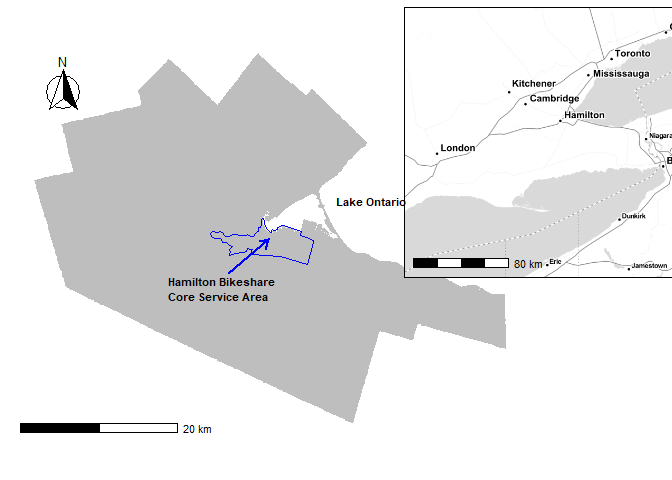
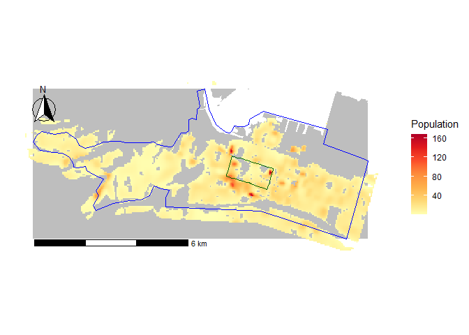
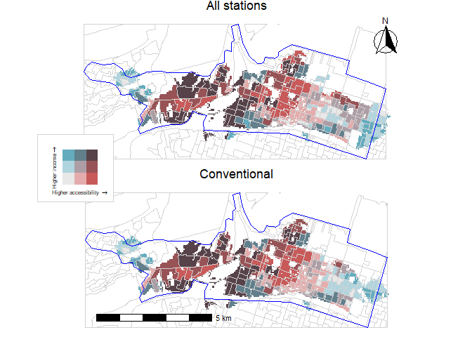

<!-- README.md is generated from README.Rmd. Please edit that file -->

# Examining spatial equity of bike share: A balanced floating catchment area approach

<!-- badges: start -->
<!-- badges: end -->

Elise Desjardins (McMaster University)  
Christopher D. Higgins (University of Toronto Scarborough)  
Antonio Páez (McMaster University)

Forthcoming in *Transportation Research Part D: Transport and
Environment*

## Abstract

Public bicycle share programs (PBSPs) can play a role in advancing
transportation equity if they make bicycling more accessible to
disadvantaged populations. In Ontario, Hamilton Bike Share expanded
their program in 2018 by adding twelve “equity” stations with the
explicit objective of increasing access for under-serviced
neighbourhoods. In this case study, we investigate differentials in
accessibility to stations using a balanced floating catchment area
approach and compare accessibility with and without the equity stations.
We analyze population interpolated to small cells to better reflect
walking to a station and conduct a sensitivity analysis at several
walking time thresholds. We then reaggregate the estimated accessibility
by income groups for further analysis. Our findings indicate that equity
stations increased accessibility for the serviced population at every
threshold examined, but the increase was relatively modest especially
for population in the bottom 20% of median total household income.

## Keywords

-   Public Bike Sharing Programs  
-   Transport equity  
-   Horizontal equity  
-   Vertical equity  
-   Accessibility  
-   Balanced floating catchment areas  
-   Hamilton  
-   Ontario
-   Reproducible research

# 1. Introduction

The potential of public bicycle share programs (PBSPs) to increase
bicycling levels is but one of many reasons for implementing such
programs in urban areas (see Fishman, Washington, and Haworth 2015;
Hosford et al. 2018, 2019). As a healthy, inexpensive, and convenient
form of public transportation, shared bicycles can encourage individuals
to take up bicycling for short local trips or first and last mile trips
to other public transportation instead of using personal vehicles. These
programs can also play a role in advancing transportation equity if they
make bicycling more accessible to disadvantaged populations. Although
PBSPs are available to the general public in over 800 cities worldwide
(Fishman 2016), and ought to be accessible to any individual who wishes
to use them, research on PBSPs indicates that inequities persist with
respect to who can use and access them.

Many PBSPs in North America now offer specific programs to address
equity that primarily focus on removing cost barriers and increasing
access for groups that are under-represented among existing users
(McNeil et al. 2019). The locations of docking stations is a common
consideration for increasing access to improve equity (Howland et al.
2017). Hamilton Bike Share (HBS), located in Hamilton, Ontario, was the
only Canadian PBSP included in a North American scan of bike share
equity programs (see McNeil et al. 2019). HBS was launched in 2015 and
currently has over 900 operational bicycles and 130 docking stations. An
equity program, *Everyone Rides Initiative*, was implemented in 2018
which expanded the program by introducing twelve “equity” stations to
more disadvantaged neighbourhoods in the core service area.

This paper examines accessibility to Hamilton Bike Share using a
balanced floating catchment area (BFCA) approach. We also conduct a
comparative analysis to the conventional two-step floating catchment
area (2SFCA) approach to highlight the benefits of this method which, to
our knowledge, has not yet been used in the cycling literature. The
paper also assesses the contribution of the equity stations to reducing
inequities in accessibility for different groups according to median
total household income, and provides policy recommendations to further
improve equity.

This paper is an example of open and reproducible research that uses
only open software for transportation and statistical analysis (R. S.
Bivand 2020; Lovelace 2021). All data were obtained from publicly
available sources and organized in the form of a data package. Following
best practices in spatial data science (Brunsdon and Comber 2020), an
open data product (Arribas-Bel et al. 2021) along with the code needed
to reproduce, modify or extend the analysis are available for
download.[1]

# 2. Literature Review

## 2.1. Public Bicycle Share Programs

Public bicycle share programs have been implemented in over 800 cities
worldwide and a great deal has been learned about their typical users to
date (Fishman 2016). In many cities, males use bike share more than
females (Brey, Castillo-Manzano, and Castro-Nuño 2017; Nickkar et al.
2019; Ogilvie and Goodman 2012; Reilly, Wang, and Crossa 2020; K. Wang
and Akar 2019; Winters, Hosford, and Javaheri 2019) as do younger age
cohorts (Brey, Castillo-Manzano, and Castro-Nuño 2017; Buck et al. 2013;
Fuller et al. 2011). However, one study found that bike share users in
Washington, DC were more likely to be female (Buck et al. 2013), which
suggests that the gender gap among bicyclists who use PBSPs is less
disparate than the gap for personal bicycle use (Fishman 2016). There is
some evidence that bike share users are less likely to own a car (Buck
et al. 2013; Reilly, Noyes, and Crossa 2020). However, the relationship
between income or education and bike share use is less clear-cut.
Stations in disadvantaged communities in Chicago have been found to
generate most of the average annual trips (Qian and Jaller 2020) and
individuals from minority or lower socioeconomic status neighborhoods in
Minneapolis-St. Paul also used the city’s PBSP more (J. Wang and Lindsey
2019b). Similar findings were reported in London (Ogilvie and Goodman
2012). Being university educated was a significant correlate of bike
share use in Montreal, Canada (Fuller et al. 2011). Not coincidentally,
financial savings have been found to motivate those on a low income to
use bike share (Fishman 2016).

## 2.2. Equity of PBSPs

The introduction of PBSPs has been accompanied by a flurry of research
focusing on who benefits from them. Many studies have examined
differences in demographics or socioeconomic status between those who
use or have access to PBSPs and those who don’t, while other research
has explored spatial inequities in where stations are located (e.g.,
Hosford and Winters 2018; Mooney et al. 2019; Hull Grasso, Barnes, and
Chavis 2020; Qian and Jaller 2020, 2021; Smith, Oh, and Lei 2015). In
Chicago, Qian and Jaller (2020) estimated ridership in the city’s PBSP
and found that a minority of docking stations were located in
disadvantaged communities, while annual members from such areas had a
lower share of trips compared to other areas in the city. Similar
results were found in Philadelphia. Despite efforts to increase equity
within the city’s PBSP, census block groups with lower median income
generated fewer trips (Caspi and Noland 2019). Trips from stations in
such areas were utilitarian (e.g., commuting to work), which points to
the importance of ensuring equitable access (Caspi and Noland 2019). In
the case of Seattle, all neighbourhoods were found to have some level of
access to dockless bicycles but those with higher incomes and more
residents of higher education had more bicycles (Mooney et al. 2019).
Babagoli et al. (2019) also found that neighbourhoods in New York City
with higher affluence had the greatest proportion of Citi Bike stations.

Chen et al. (2019) distinguish two types of equity related to bike
share, horizontal and vertical, based on the work of Delbosc and Currie
(Delbosc and Currie 2011). Horizontal equity leads to balanced or equal
distribution of accessibility and costs for all similar groups, while
vertical equity would involve greater and targeted access for
under-represented or disadvantaged populations (Z. Chen et al. 2019).
Both are of interest to researchers and transportation planners since
they are often linked in that advantage, or conversely disadvantage, has
spatial patterns. Bike share equity programs (see McNeil et al. 2019;
Howland et al. 2017) can be considered efforts to improve vertical
equity since they favour groups that have benefited less from PBSPs
through the placement of stations or equitable fee structures.

On the whole, existing studies highlight the need for PBSPs to be more
accessible for equity populations in order to increase use beyond the
“typical” users. This has been the focus of recent research (see, among
others, Auchincloss et al. 2020; Hull Grasso, Barnes, and Chavis 2020;
MacArthur et al. 2020). Offering more people the option of using
sustainable and active transportation, particularly those who have lower
socioeconomic status and might benefit the most, is a worthy policy goal
for cities with PBSPs. However, exploring transportation equity by
investigating where docking stations are located, often using
neighborhoods or census tracts as the geographical unit of analysis, can
ignore or miss the benefits that may be derived from adjacent zones.
Meaning that, stations may be lacking in certain neighborhoods but there
may be stations accessible within a reasonable walking time. This is
where geographical accessibility becomes an important consideration.

## 2.3. Accessibility Approaches

Accessibility has been applied in both a positive and normative way to
inform transportation planning (Páez, Scott, and Morency 2012), but its
utility to this field has evolved over the past century and has
increasingly become linked with recent planning interests in
prioritizing modes that are suitable for local trips like walking and
cycling (Levine 2020). Beyond the utility derived from using shared
bicycles to access destinations of value, docking stations themselves
are amenities because they offer a transportation service. Therefore,
the ease of reaching these stations, which are spread spatially in a
given area, can affect use of the PBSP.

The location and size of docking stations are two factors that are
relevant to accessibility. Since the time or distance needed to reach a
docking station decreases the potential of accessing the program, the
location matters. Kabra et al. (2020) found that the majority of bike
share usage in Paris, France comes from areas within 300 m of stations,
which amounts to 2-4 minutes walking by an adult who does not have a
disability. Other studies have adopted (2018, 2019) Similar to other
public amenities affected by crowding, the utility of docking stations
is also limited by the *maximum* number of bicycles that they can hold
(e.g., their size). Accessibility analyses for PBSPs constitute a
positive and evaluation-based approach that also has the potential to
inform equity efforts. For instance, Wang and Lindsey (2019a)
investigated whether new or relocated bike share stations increased
accessibility and use, which offered important insights to improve the
performance of the program.

Several approaches have been commonly used for measuring place-based
accessibility, including cumulative opportunities, gravity, and
utility-based measures (Geurs and van Wee 2004; Handy and Niemeier
1997). The gravity-based approach involves weighting destination
opportunities, such as the quantity of bike share stations, by the time
required to reach them from an origin using an impedance function (Handy
and Niemeier 1997; Kwan 1998). While such measures are suitable for
capturing the potential for reaching destinations from a given location,
they do not take demand or congestion effects into account which is an
important consideration when calculating accessibility for amenities
such as bike share stations.

In contrast, floating catchment area (FCA) methods have been widely
employed in health care accessibility research. The benefit of this
approach is that the method incorporates information on capacity and
demand in calculating accessibility. Geurs and van Wee (2004) note
“competition for activities with restricted capacity” should be taken
into account for land-use components of accessibility. The FCA approach
is more appropriate and informative than calculating
provider-to-population ratios (PPR) that simply divide the level of
supply of a service (e.g., the number of bicycle racks at a station) by
the population who have access to the service (Paez, Higgins, and Vivona
2019). In particular, the Two-Step Floating Catchment Area (2SFCA)
method (Luo and Wang 2003; Radke and Mu 2000) produces flexible
catchment areas instead of using rigid boundaries like PPR. In the first
step, a ratio of supply to demand at service locations is calculated,
such as the number of beds at a hospital divided by the number of people
within the catchment area of the hospital, weighted by the distance
involved in reaching the facility. Next, these service level ratios are
allocated back to the population centers and summarized as a measure of
congested accessibility. Thus, this model does a good job of considering
potential crowding or competition for services. However, overlapping
catchment areas from the conventional FCA approach lead to inflation of
population totals and deflation of service levels across a study area
which generates inaccurate or misleading accessibility estimates (Paez,
Higgins, and Vivona 2019). While there have been many methodological
innovations in FCA methods (e.g., Delamater 2013; Luo and Wang 2003; Luo
and Qi 2009; Radke and Mu 2000; Wan, Zou, and Sternberg 2012), a recent
improvement to this approach was achieved through a simple and intuitive
balancing of the impedance that addressed the effects of demand and
service inflation found in earlier FCA approaches (see Paez, Higgins,
and Vivona 2019). This provides more useful information because it does
not assume that people are limited to service within pre-defined
boundaries (Paez, Higgins, and Vivona 2019).

When measuring accessibility, researchers have also taken different
approaches when it comes to the aggregation of data, either by using the
individual or household as the smallest unit of analysis or larger
spatial zones. Previous research on bike share equity has typically used
a meso- or macro-level approach with aggregated data from entire
neighborhoods or census tracts (Babagoli et al. 2019; Mooney et al.
2019; Qian and Jaller 2020; J. Wang and Lindsey 2019b), although there
are recent exceptions (Z. Chen et al. 2019; Z. Chen and Li 2021). This
is also true for studies examining correlates of bike share demand (J.
Wang and Lindsey 2019a). Handy and Niemeier (1997) note that using
disaggregated data in accessibility analyses provides a more accurate
estimate for individuals. Chen et al. (2019, 530) are in favour of using
disaggregated data, which they did in their recent analysis of Tampa’s
PBSP, because they note “the use of aggregated data might hinder our
understanding of the equity impacts since individual disparities are
absorbed after aggregation.”

## 2.4 Previous Research

Our analysis builds upon a previous study (Hosford and Winters 2018),
which found that areas in Hamilton with less advantage are better served
by the city’s PBSP compared to other Canadian cities (i.e., Toronto,
Vancouver, Montreal, and Ottawa-Gatineau) where areas that are less
deprived have greater access. Hosford and Winters (2018, 47) acknowledge
that “Hamilton stands out in that the lower income neighborhoods are
located near the city center and wealthier neighborhoods are in the
surrounding suburban areas.” Therefore, the core service area for the
PBSP in Hamilton by default covers more of the disadvantaged areas in
the city. However, there is also a great deal of variation in income in
the core service area because of the local university and increasing
gentrification. Hosford and Winters (2018) took a macro-level approach
in their analysis by using dissemination areas *across* the city as the
unit of analysis. They did not focus specifically on the core service
area and did not differentiate between conventional and equity stations.

Therefore, this paper also contributes to the cycling literature by
expanding the analysis of Hosford and Winters (2018) to assess equity in
accessibility to HBS and explore the contribution of the equity stations
added to Hamilton’s PBSP.

# 3. Case Study

## 3.1. Original System

The case study of this paper is the city of Hamilton, Ontario, Canada.
Before June 2020, the program was known as Social Bicycles or SoBi
Hamilton, but is now called Hamilton Bike Share (HBS). The core service
area spans 40 sq.km of the city, although it was planned to be 20 sq.km
(Hamilton 2015a), and roughly 138,000 people are within 30 minutes
walking of a station \[see Figure \]. This represents roughly one fifth
of the total population of the Hamilton Census Metropolitan Area
according to the 2016 Canadian Census. The City of Hamilton undertook a
large public engagement campaign to validate the locations of stations
that had been selected and to crowdsource potential locations for
additional locations (Hamilton 2014). Most of the potential locations
that were suggested were in the east end of the core service area that
lack stations or in neighborhoods not serviced by the PBSP. The program
was enthusiastically welcomed in the city in 2015 - within three weeks
of launching, 10,000 trips had been made (Hamilton 2015b), however
inadequate coverage given the size of the program’s service area was
identified as a problem early on, and transportation planners noted that
the small size (i.e., supply of bicycle racks) and low quantity of
stations would lead to challenges in balancing the system (Hamilton
2015a).

## 3.2. Equity Initiative

Hamilton Bike Share Inc., the non-profit operator, launched an equity
program, Everyone Rides Initiative (ERI), in 2018 with the objective of
reducing barriers that may prevent individuals from accessing the
program. Additional bicycles and twelve “equity” stations were added to
the core service area in more disadvantaged and under-serviced
neighbourhoods. The equity program also offers subsidized memberships to
individuals who identify as low income, and complements this service
with cycle skills education. A comparable program can be found in
Philadelphia (see Caspi and Noland 2019).

## 3.3. Current System

As of June 2020, HBS has 900 bikes, 130 stations \[see Figure \], and
over 26,000 active memberships (Hamilton 2015b). The core service area
remains 40 sq.km. The program has twelve “equity” stations and 118
“conventional” stations (i.e., that were not explicitly added to address
inequities in the program). The City of Hamilton has positioned stations
between 300 and 600 m apart (Scott, Lu, and Brown 2021), but anticipates
that they will service those living within a 250 m buffer (Hamilton
2015a). The latter constitutes a normative statement: people ought to be
able to access a station in less than 600 m if they live in the core
service area, with most usage coming from 250 m around. However, it is
not known how far people are actually willing to travel to reach a
station. It would be reasonable to assume that people are willing to
walk beyond this threshold to access other stations if the ones nearest
them have no supply of bicycles.

The core service area of Hamilton Bike Share is outlined in blue.
Hamilton Census Metropolitan Area is shown in grey.

The spatial distribution of bike share docking stations in Hamilton,
Ontario. Conventional stations are in purple and equity (ERI) stations
are in orange. The service area of Hamilton Bike Share is outlined in
blue and the city’s downtown core is outlined in dark green. Hamilton
Census Metropolitan Area is shown in grey.

# 4. Methods and Data

## 4.1. Balanced Floating Catchment Area

The BFCA method was developed to address issues with demand and supply
inflation that result from the overlapping catchment areas produced by
earlier FCA methods (Paez, Higgins, and Vivona 2019). Páez et al. (2019)
adjusted the impedance weights so that both supply and demand are
proportionally allocated. The result is a FCA method that balances the
population and level of service by eliminating the over-counting of
population and level of service that leads to distortions in demand and
supply.

The first step in the FCA method is to allocate the population to be
serviced by each docking station:

As seen in the equation above, the population allocated to station
 is the weighted sum of
the population in the region; a spatial weight

represents the friction that the population at
 faces when reaching
station , and is usually
given by a distance-decay function, so that each station is assumed to
service only a segment of the population within a limited geographical
range. The level of service of station
 in bicycle racks per
person is the supply at each station (i.e., the maximum number of
bicycle racks) divided by the population within the established
catchment area:

In the second step, the accessibility of population unit
 is calculated as the
weighted sum of the level of service of all stations that can be reached
from there according to the spatial weights:

The balanced approach of Páez et al. (2019) replaces the spatial weights
with normalized versions as follows. In the first step, the population
is weighted with:

and in the second step, the level of service is weighted using:

These weights satisfy the following properties:

and:

With these weights, accessibility can be calculated without risk of
demand or supply inflation:

By allocating the population and level of service proportionally, this
method preserves the values of the population and level of service
since:

In fact, since the proportional allocation procedure means that any
proportion of the population allocated to a station is never allocated
to other stations, and conversely any level of service allocated to a
population is never re-allocated elsewhere, this property is replicated
for any level of aggregation.

## 4.2. Pycnophylactic Interpolation

Since walking trips to a docking station likely happen at a level lower
than even the smallest census geography, this requires a more
disaggregated approach than the use of census geographies. For this
reason, we implemented our analysis parting from small population cells
to better reflect the friction of walking to a docking station, which is
an important component of a bike share trip (Z. Chen et al. 2019).

To obtain population at sub-census geography levels, we used
pycnophylactic interpolation (Tobler 1979). We obtained population data
from the 2016 Census of Canada for dissemination areas (DA), which is
the smallest publicly available census geography in Canada. These zonal
values of the population were interpolated to smaller polygons that are
50-by-50 m in size. Pycnophylactic interpolation involves smoothing out
the population from each DA while preserving total volume. When
interpolating the population at this high level of resolution, it is
important to ensure that population numbers are not allocated to areas
where people do not live in Hamilton (for example, to parks or large
institutional buildings, etc.). To do so, we retrieved shapefiles for
various geographic features from Open Hamilton. Next, we removed these
features from the PBSP core service area and used pycnophylactic
interpolation to disaggregate and reallocate population within the
remaining area \[see Figure \].

Interpolated population in Hamilton Bike Share’s core service area
(outlined in blue) and within 30 minutes of walking to the core service
area. Each population cell is 50-by-50 m in size. The downtown area is
outlined in dark green.

## 4.3. Travel Time Matrix

To calculate walking times from the centroid of the population cells to
docking stations, we extracted OpenStreetMap data for HBS’s service area
from [BBBike](https://download.bbbike.org/osm/bbbike/), an online cycle
route planner that interfaces with OpenStreetMap. OpenStreetMap data
provides the networks for calculating walking times from each population
cell to nearby docking stations, using a maximum walking distance of 10
km and walking time of 30 minutes as thresholds. A travel time matrix
was created with the origins as the coordinates of the population cells
and the destinations as the coordinates of the docking stations within
the maximum threshold. This process provides a more realistic measure of
the friction of reaching stations by taking infrastructure into account
network travel times, rather than using the Euclidean distance from
population cell to station. Routing and travel time calculations were
completed using the `R` package `r5r`, used for rapid realistic routing
operations (Pereira et al. 2021).

## 4.4. Data

All data for this research were accessed from publicly available Census
of Canada sources, from OpenStreetMaps, and from Open Hamilton[2], a
public online repository of data curated by the City of Hamilton. Median
total household income statistics were drawn from the 2016 Canadian
Census.

# 5. Results

## 5.1. Accessibility by Distance Thresholds

Consensus regarding the distance that individuals are willing to walk to
access a docking station is lacking, but the literature on walking
behaviour provided some guidelines to determine the thresholds for our
sensitivity analysis. Previous studies have found that living within 250
m (Fuller et al. 2011) and 300 m (Kabra, Belavina, and Girotra 2020) of
a docking station is correlated with bike share use. Some studies have
defined “close proximity” to a docking station as 500 metres or less
(Fuller et al. 2013; Hosford et al. 2018, 2019), while other research
has found that walking trips are less than 600 m and rarely more than
1200 m (Millward, Spinney, and Scott 2013) or a median distance of 650 m
(Larsen, El-Geneidy, and Yasmin 2010). HBS will often depict a map at
some docking stations to show the locations of the other nearest
stations within a five minute walk, which suggests that this is an
average distance that people are expected to walk. The National
Association of City Transportation Officials (NACTO) has a similar
normative guide (City Transportation Officials 2015).

In the present case, we found that accessibility calculated using the
BFCA method increased with a threshold between two and four minutes, but
was then maximized at five minutes. Accessibility decreased
substantially after eight minutes, which is intuitive given that demand
on a limited supply increases as more people can reach each station.

We experimented with various thresholds by conducting a sensitivity
analysis to calculate accessibility at different walking times from
population cell to docking stations: three minutes, five minutes, ten
minutes, and fifteen minutes. We categorized these thresholds as
minimum, average, maximum, and extreme, respectively. At each threshold,
we compared accessibility between the current system and the original
system to examine the contribution of the twelve equity stations. When
considering the results reported below, it is important to remember that
accessibility is technically a form of smoothing (O’Kelly and Horner
2003, 7–8): smaller thresholds produce less smoothing (which can result
in “spiky” accessibility landscapes), while larger thresholds produce
more smoothing and fewer spikes.

In the analysis we use the following distance decay function:

where 
is the relevant threshold. The weights are standardized as discussed
above.

<!-- Calculate accessibility for different thresholds -->

### 5.1.1. Minimum Threshold

With a walking distance of three minutes, we found that the total level
of service is 25.2 bicycle racks per person system-wide in the original
system configuration (i.e., without equity stations). The addition of
equity stations increases this slightly to 25.4 bicycles per person.
This total level of service is allocated to the population to obtain the
levels of accessibility, which turn out to be relatively uniform
overall, with the exception of two small areas where accessibility is
slightly higher. This high level of system-wide accessibility occurs
because the population that can reach a docking station when travel time
is three minutes or less is very limited, and accessibility is strongly
shaped by a few locations that concentrate population and stations. For
this reason, accessibility is highly concentrated in small areas around
those stations. The map is not shown, since it is less informative, but
can be recreated using the source code and data.

### 5.1.2. Medium Threshold

With a walking distance of five minutes, we found that there are 68.6
bicycle racks per person system-wide in the original system
configuration (i.e., without equity stations). With the addition of
equity stations, there are now 68.8 bicycle racks per person. At this
threshold, there are more bicycle racks per person than at the minimum
threshold. System-wide accessibility has in fact increased: the
population that can reach the stations has grown, but not to the the
point that congestion effects begin to take place. Figure presents a
comparison of accessibility between the systems. Again, accessibility is
fairly uniform, with the exception of one very small area. The equity
stations noticeably increase accessibility in the east end of the core
service area by filling gaps in PBSP coverage.

Accessibility at 5 minutes walk (average threshold) compared between
current system with equity stations and the original system without
equity stations.

### 5.1.3. High Threshold

With a walking distance of ten minutes, we found that there are 3.61
bicycle racks per person system-wide in the original system
configuration (i.e., without equity stations). With the addition of
equity stations, there are now 3.74 bicycles per person. Figure presents
a comparison of accessibility between the systems. Differences in
accessibility across the service area are now apparent, with users near
the university and its adjacent neighborhoods, as well as neighborhoods
north of the downtown area (the latter is outlined in green), having
slightly higher accessibility. While the differences are modest, they
are more apparent at this threshold than at shorter walking distances,
especially in the more disadvantaged neighbourhoods in the east end of
the core service area where equity stations were added.

Accessibility at 10 minutes walk (maximum threshold) compared between
current system with equity stations and the original system without
equity stations.

### 5.1.4. Extreme Threshold

With a walking distance of fifteen minutes, we found that there are 2.44
bicycle racks per person system-wide in the original system
configuration (i.e., without equity stations). With the addition of
equity stations, there are now 2.55 bicycles per person. Figure presents
a comparison of accessibility between the systems. Users near the
university and the neighborhoods north of the downtown area (the latter
is outlined in green) have the highest accessibility, followed by those
who live in the city’s downtown area. Accessibility in the east end,
where equity stations were implemented, of the core service area remains
lower than other areas.

Accessibility at 15 minutes walk (extreme threshold) compared between
current system with equity stations and the original system without
equity stations.

## 5.2. Comparative Analysis

To highlight the benefit of using the BFCA approach, we conducted a
comparative analysis with the 2SFCA method. The latter method does not
allocate population and level of service proportionally, which means
that there are often substantial amounts of multiple counting each.
Figure shows the level of inflation and deflation at five minutes that
results when the balanced and the conventional FCA methods are compared.
The inflation and deflation is defined as the ratio of the level of
service and accessibility calculated using the conventional approach to
the balanced approach. This effect has been documented in other studies
(W. Chen et al. 2021; Paez, Higgins, and Vivona 2019). Figure shows that
in some locations the level of service is deflated by up to 80%. This is
evident for the equity stations in the east end of the core service
area. Noticeably, the level of service is least deflated in the downtown
area, likely due to the density of docking stations. Figure shows that
accessibility is inflated by as much as 50% in many areas across the
city.

Deflation of level of service at 5 minutes walk (average threshold) in
the current system with equity stations.

Inflation of accessibility at 5 minutes walk (average threshold) in the
current system with equity stations.

## 5.3. Accessibility by Median Total Household Income

To examine whether accessibility to HBS was increased for groups with
lower income, we estimated what level of accessibility accrues to how
many people in different income strata. To this end, we took our small
population cells and aggregated the accessibility and population by the
median total household income as imputed from the dissemination areas. A
unique property of the BFCA method, which does not hold for the 2SFCA
approach because of the inflation/deflation issues discussed above, is
that accessibility and population data can be re-aggregated using income
as an aggregator criterion, while preserving the total population and
the level of service. This avoids demand and supply inflation, and also
enables us to present findings in a way that is more intuitive to
interpret. Figures , , , and depict bivariate choropleth maps that
combine the spatial distribution of accessibility and median total
household income, using tertiles for the coloring scheme.

Bivariate map of accessibility and income at the minimum threshold of
three minutes with equity stations (top panel) and without equity
stations (bottom panel).

Bivariate map of accessibility and income at the average threshold of
five minutes with equity stations (top panel) and without equity
stations (bottom panel).

Bivariate map of accessibility and income at the maximum threshold of
ten minutes with equity stations (top panel) and without equity stations
(bottom panel).

Bivariate map of accessibility and income at the extreme threshold of
fifteen with equity stations (top panel) and without equity stations
(bottom panel).

Table presents accessibility levels by income strata. As expected, the
extreme threshold of fifteen minutes is associated with the largest
number of people who are within the assumed service area of docking
stations. We found that stations added to HBS expanded the spatial
coverage of HBS, leading to more balance across the core service area.
This is particularly evident at the minimum and average thresholds of
three and five minutes, respectively, where the equity stations fill a
number of gaps in program coverage.

In line with Hosford and Winters’ (2018) findings, we found that
accessibility to HBS was high for individuals in the bottom and second
quintiles of median total household income who live in the centre of the
core service area. This may well be an artifact of the spatial
socioeconomic and demographic profile of Hamilton, where the most dense
parts of the city (where a PBSP is most easily launched) are also those
with relatively lower incomes (Hosford and Winters 2018). On the other
hand, we found the levels of accessibility to Hamilton’s PBSP are
generally lower for populations in the bottom 20% of median total
household income, compared to populations in the top 20%.

Our analysis revealed that the addition of equity stations increased
accessibility to HBS by growing the population serviced irrespective of
the walking threshold. The largest gains were made for dissemination
areas in the second 20% median total household income, where an
additional 3,073 and 5,395 people could reach a docking station within
three and five minutes walk, respectively, after the addition of equity
stations. However, we found that there were only small increases in the
population in the bottom 20% of median total household income who are
serviced by the equity stations, and the accessibility gains are also
quite modest and smaller than for populations in the second and third
quintiles of median total household income. This suggests that
inequities in accessibility to HBS persist according to income, albeit
this depends on the walking time thresholds. With and without equity
stations, people in the top 20% of income have the highest level of
access at a threshold of ten and fifteen minutes. Although dissemination
areas in the second 20% have the highest level of access by a
significant amount at lower distance thresholds, the bottom 20%, who may
benefit more from increased access to HBS, have the lowest accessibility
at three minutes threshold and the second lowest access at all other
thresholds.

<table class="table" style="margin-left: auto; margin-right: auto;border-bottom: 0;">
<caption>
Accessibility and population serviced by income quintile and between
systems (with and without equity stations). Total population is the
population by income quintile in the DAs that have any PBSP service at
all.
</caption>
<thead>
<tr>
<th style="empty-cells: hide;border-bottom:hidden;" colspan="2">
</th>
<th style="border-bottom:hidden;padding-bottom:0; padding-left:3px;padding-right:3px;text-align: center; " colspan="2">

Without Equity Stations

</th>
<th style="border-bottom:hidden;padding-bottom:0; padding-left:3px;padding-right:3px;text-align: center; " colspan="2">

With Equity Stations

</th>
<th style="border-bottom:hidden;padding-bottom:0; padding-left:3px;padding-right:3px;text-align: center; " colspan="2">

Difference

</th>
</tr>
<tr>
<th style="text-align:left;">
Income Quintile
</th>
<th style="text-align:center;">
Total Population
</th>
<th style="text-align:center;">
Population
</th>
<th style="text-align:center;">
Accessibility
</th>
<th style="text-align:center;">
Population
</th>
<th style="text-align:center;">
Accessibility
</th>
<th style="text-align:center;">
Population
</th>
<th style="text-align:left;">
Accessibility
</th>
</tr>
</thead>
<tbody>
<tr grouplength="5">
<td colspan="8" style="background-color: #8f9498; color: #fff;">
<strong>Threshold - 3 minutes</strong>
</td>
</tr>
<tr>
<td style="text-align:left;padding-left: 2em;" indentlevel="1">
Bottom 20%
</td>
<td style="text-align:center;">
43441
</td>
<td style="text-align:center;">
22359
</td>
<td style="text-align:center;">
2.377
</td>
<td style="text-align:center;">
22798
</td>
<td style="text-align:center;">
2.424
</td>
<td style="text-align:center;">
439
</td>
<td style="text-align:left;">
0.047
</td>
</tr>
<tr>
<td style="text-align:left;padding-left: 2em;" indentlevel="1">
Second 20%
</td>
<td style="text-align:center;">
33312
</td>
<td style="text-align:center;">
9347
</td>
<td style="text-align:center;">
12.203
</td>
<td style="text-align:center;">
12420
</td>
<td style="text-align:center;">
12.281
</td>
<td style="text-align:center;">
3073
</td>
<td style="text-align:left;">
0.078
</td>
</tr>
<tr>
<td style="text-align:left;padding-left: 2em;" indentlevel="1">
Third 20%
</td>
<td style="text-align:center;">
30940
</td>
<td style="text-align:center;">
7745
</td>
<td style="text-align:center;">
3.093
</td>
<td style="text-align:center;">
9455
</td>
<td style="text-align:center;">
3.156
</td>
<td style="text-align:center;">
1710
</td>
<td style="text-align:left;">
0.063
</td>
</tr>
<tr>
<td style="text-align:left;padding-left: 2em;" indentlevel="1">
Fourth 20%
</td>
<td style="text-align:center;">
20185
</td>
<td style="text-align:center;">
1673
</td>
<td style="text-align:center;">
4.119
</td>
<td style="text-align:center;">
1673
</td>
<td style="text-align:center;">
4.119
</td>
<td style="text-align:center;">
0
</td>
<td style="text-align:left;">
0.000
</td>
</tr>
<tr>
<td style="text-align:left;padding-left: 2em;" indentlevel="1">
Top 20%
</td>
<td style="text-align:center;">
27541
</td>
<td style="text-align:center;">
2151
</td>
<td style="text-align:center;">
3.757
</td>
<td style="text-align:center;">
2416
</td>
<td style="text-align:center;">
3.784
</td>
<td style="text-align:center;">
265
</td>
<td style="text-align:left;">
0.027
</td>
</tr>
<tr grouplength="5">
<td colspan="8" style="background-color: #8f9498; color: #fff;">
<strong>Threshold - 5 minutes</strong>
</td>
</tr>
<tr>
<td style="text-align:left;padding-left: 2em;" indentlevel="1">
Bottom 20%
</td>
<td style="text-align:center;">
43441
</td>
<td style="text-align:center;">
35477
</td>
<td style="text-align:center;">
1.302
</td>
<td style="text-align:center;">
35803
</td>
<td style="text-align:center;">
1.357
</td>
<td style="text-align:center;">
326
</td>
<td style="text-align:left;">
0.055
</td>
</tr>
<tr>
<td style="text-align:left;padding-left: 2em;" indentlevel="1">
Second 20%
</td>
<td style="text-align:center;">
33312
</td>
<td style="text-align:center;">
17513
</td>
<td style="text-align:center;">
56.048
</td>
<td style="text-align:center;">
22908
</td>
<td style="text-align:center;">
56.137
</td>
<td style="text-align:center;">
5395
</td>
<td style="text-align:left;">
0.089
</td>
</tr>
<tr>
<td style="text-align:left;padding-left: 2em;" indentlevel="1">
Third 20%
</td>
<td style="text-align:center;">
30940
</td>
<td style="text-align:center;">
15117
</td>
<td style="text-align:center;">
4.259
</td>
<td style="text-align:center;">
18309
</td>
<td style="text-align:center;">
4.291
</td>
<td style="text-align:center;">
3192
</td>
<td style="text-align:left;">
0.032
</td>
</tr>
<tr>
<td style="text-align:left;padding-left: 2em;" indentlevel="1">
Fourth 20%
</td>
<td style="text-align:center;">
20185
</td>
<td style="text-align:center;">
2867
</td>
<td style="text-align:center;">
1.094
</td>
<td style="text-align:center;">
3116
</td>
<td style="text-align:center;">
1.095
</td>
<td style="text-align:center;">
249
</td>
<td style="text-align:left;">
0.001
</td>
</tr>
<tr>
<td style="text-align:left;padding-left: 2em;" indentlevel="1">
Top 20%
</td>
<td style="text-align:center;">
27541
</td>
<td style="text-align:center;">
4074
</td>
<td style="text-align:center;">
6.256
</td>
<td style="text-align:center;">
4540
</td>
<td style="text-align:center;">
6.264
</td>
<td style="text-align:center;">
466
</td>
<td style="text-align:left;">
0.008
</td>
</tr>
<tr grouplength="5">
<td colspan="8" style="background-color: #8f9498; color: #fff;">
<strong>Threshold - 10 minutes</strong>
</td>
</tr>
<tr>
<td style="text-align:left;padding-left: 2em;" indentlevel="1">
Bottom 20%
</td>
<td style="text-align:center;">
43441
</td>
<td style="text-align:center;">
41824
</td>
<td style="text-align:center;">
0.604
</td>
<td style="text-align:center;">
41981
</td>
<td style="text-align:center;">
0.622
</td>
<td style="text-align:center;">
157
</td>
<td style="text-align:left;">
0.018
</td>
</tr>
<tr>
<td style="text-align:left;padding-left: 2em;" indentlevel="1">
Second 20%
</td>
<td style="text-align:center;">
33312
</td>
<td style="text-align:center;">
27546
</td>
<td style="text-align:center;">
0.862
</td>
<td style="text-align:center;">
30503
</td>
<td style="text-align:center;">
0.929
</td>
<td style="text-align:center;">
2957
</td>
<td style="text-align:left;">
0.067
</td>
</tr>
<tr>
<td style="text-align:left;padding-left: 2em;" indentlevel="1">
Third 20%
</td>
<td style="text-align:center;">
30940
</td>
<td style="text-align:center;">
22394
</td>
<td style="text-align:center;">
0.776
</td>
<td style="text-align:center;">
25128
</td>
<td style="text-align:center;">
0.802
</td>
<td style="text-align:center;">
2734
</td>
<td style="text-align:left;">
0.026
</td>
</tr>
<tr>
<td style="text-align:left;padding-left: 2em;" indentlevel="1">
Fourth 20%
</td>
<td style="text-align:center;">
20185
</td>
<td style="text-align:center;">
4544
</td>
<td style="text-align:center;">
0.225
</td>
<td style="text-align:center;">
4989
</td>
<td style="text-align:center;">
0.227
</td>
<td style="text-align:center;">
445
</td>
<td style="text-align:left;">
0.002
</td>
</tr>
<tr>
<td style="text-align:left;padding-left: 2em;" indentlevel="1">
Top 20%
</td>
<td style="text-align:center;">
27541
</td>
<td style="text-align:center;">
7989
</td>
<td style="text-align:center;">
1.346
</td>
<td style="text-align:center;">
9078
</td>
<td style="text-align:center;">
1.348
</td>
<td style="text-align:center;">
1089
</td>
<td style="text-align:left;">
0.002
</td>
</tr>
<tr grouplength="5">
<td colspan="8" style="background-color: #8f9498; color: #fff;">
<strong>Threshold - 15 minutes</strong>
</td>
</tr>
<tr>
<td style="text-align:left;padding-left: 2em;" indentlevel="1">
Bottom 20%
</td>
<td style="text-align:center;">
43441
</td>
<td style="text-align:center;">
42208
</td>
<td style="text-align:center;">
0.536
</td>
<td style="text-align:center;">
42327
</td>
<td style="text-align:center;">
0.557
</td>
<td style="text-align:center;">
119
</td>
<td style="text-align:left;">
0.021
</td>
</tr>
<tr>
<td style="text-align:left;padding-left: 2em;" indentlevel="1">
Second 20%
</td>
<td style="text-align:center;">
33312
</td>
<td style="text-align:center;">
30507
</td>
<td style="text-align:center;">
0.555
</td>
<td style="text-align:center;">
31069
</td>
<td style="text-align:center;">
0.614
</td>
<td style="text-align:center;">
562
</td>
<td style="text-align:left;">
0.059
</td>
</tr>
<tr>
<td style="text-align:left;padding-left: 2em;" indentlevel="1">
Third 20%
</td>
<td style="text-align:center;">
30940
</td>
<td style="text-align:center;">
26108
</td>
<td style="text-align:center;">
0.554
</td>
<td style="text-align:center;">
26660
</td>
<td style="text-align:center;">
0.581
</td>
<td style="text-align:center;">
552
</td>
<td style="text-align:left;">
0.027
</td>
</tr>
<tr>
<td style="text-align:left;padding-left: 2em;" indentlevel="1">
Fourth 20%
</td>
<td style="text-align:center;">
20185
</td>
<td style="text-align:center;">
6312
</td>
<td style="text-align:center;">
0.093
</td>
<td style="text-align:center;">
7435
</td>
<td style="text-align:center;">
0.096
</td>
<td style="text-align:center;">
1123
</td>
<td style="text-align:left;">
0.003
</td>
</tr>
<tr>
<td style="text-align:left;padding-left: 2em;" indentlevel="1">
Top 20%
</td>
<td style="text-align:center;">
27541
</td>
<td style="text-align:center;">
10209
</td>
<td style="text-align:center;">
0.808
</td>
<td style="text-align:center;">
11089
</td>
<td style="text-align:center;">
0.811
</td>
<td style="text-align:center;">
880
</td>
<td style="text-align:left;">
0.003
</td>
</tr>
</tbody>
<tfoot>
<tr>
<td style="padding: 0; " colspan="100%">
Note: 
</td>
</tr>
<tr>
<td style="padding: 0; " colspan="100%">

</td>
</tr>
<tr>
<td style="padding: 0; " colspan="100%">
a With equity stations = Hamilton Bike Share current system
(118 conventional stations, 12 equity stations)
</td>
</tr>
<tr>
<td style="padding: 0; " colspan="100%">
b Without equity stations = Hamilton Bike Share original
system (118 conventional stations, no equity stations)
</td>
</tr>
</tfoot>
</table>

# 6. Discussion

Using disaggregated population data, we examined equity in accessibility
to Hamilton Bike Share (HBS), with a focus on assessing the contribution
of the program’s equity stations. The BFCA approach, combined with
pycnophylactic interpolation, enabled us to measure accessibility on a
micro scale which better reflects the scale at which walking takes place
and avoids the “absorption of disparities,” as articulated by Chen et
al. (2019) and elsewhere in the transportation literature (National
Academies of Sciences 2004; Rowangould, Karner, and London 2016). Our
method also considers potential demand and supply, as well as congestion
effects, in the calculation of accessibility, which is important for
services like PBSPs but not accounted for in other common accessibility
models. Unlike the 2SFCA method, there was no inflation or deflation in
our accessibility estimates because population and level of service were
preserved (see Figure and Figure ). This differentiates our analysis
from similar papers exploring equity in PBSPs that use larger
geographical units of analysis or that focus only on station location
instead of level of service. In this way, our paper has made an
important contribution by applying an intuitive and useful approach not
previously used in the cycling literature to measure accessibility to a
PBSP. This open and reproducible research could be expanded for
additional analysis using other individual-level data in Hamilton (e.g.,
age, gender, household size, education, etc.) or applied to PBSPs in
other North American cities.

The sensitivity analysis revealed that accessibility to docking stations
is maximized at five minutes and decreases significantly by eight
minutes \[see Table \]. This reflects the normative guide advertised on
some docking stations in Hamilton showing other stations within a five
minute walk, as well as the directive of NACTO (City Transportation
Officials 2015). We found that over 118,000 people can access a bike
share station within a 15 minute walk, which represents roughly 85% of
the total population in the core service area \[see Table \]. At a
minimum threshold of three minutes, too few people can reach stations
which leads to relatively high levels of service since there is little
crowding for the stations. However, accessibility is at its lowest after
eight minutes whereby congestion effects due to increased potential
demand kick in. Chen et al. (2019) also found that accessibility
decreases as larger geographical units are used in the estimation, since
more people can access the service.

The City of Hamilton has recognized from the launch of HBS that
substantially more stations and bicycles are needed to service the area
(Hamilton 2015a). With a service area of 40 sq.km, it is estimated that
Hamilton should have between 380 and 440 stations instead of 130, and
1,500 bicycles instead of 900 (Hamilton 2015a). The City acknowledged
that reduced capacity within the system led to gaps in coverage in some
areas of the city “with some areas not having the recommended station
density of 300m between stations or 10 stations per square km” (Hamilton
2015a). Figures , , , and demonstrate how gaps in accessibility were
filled by the additional equity stations implemented by Hamilton Bike
Share. The improvement in accessibility is most noticeable at the
average and maximum thresholds in the east end of the core service area,
which corresponds to the neighbourhoods where stations were added.
However, the contribution of equity stations to reducing inequities in
accessibility was modest.

The equity stations were added to HBS as a targeted initiative to
increase access for equity users in specific under-serviced
neighbourhoods. However, we found that inequities persisted as evidenced
by differences in accessibility according to income quintile (Table ).
While the addition of equity stations seems to modestly increase
accessibility for all income groups at all thresholds, they did not
increase accessibility substantially for any single income group. Most
importantly, individuals in the bottom 20% of median total household
income have the second lowest level of access to HBS at most thresholds
(average, maximum, and extreme). At the minimum threshold, the bottom
20% have the lowest level of access. This suggests that additional
equity stations are needed to more sufficiently address vertical equity.
While previous research found that neighborhoods with more disadvantage
are better serviced by HBS, the authors used the Pampalon Deprivation
Index to determine the level of disadvantage for dissemination areas
*across* the city not just within the core service area (Hosford and
Winters 2018). Instead, we used median total household income for each
dissemination area *within* the core service area. We conclude that
Hamilton’s PBSP, while by default located in areas with more deprivation
compared to other cities as noted by Hosford and Winters (2018),
continues to have disparities in accessibility between income groups.
With equity stations, many areas with low median total household income
in the east end of the service area have zero or low accessibility at
the average threshold of five minutes. At the maximum and extreme
thresholds, the top 20% have the highest level of access to HBS. These
findings align broadly with other studies from Tampa (Z. Chen et al.
2019), Philadelphia (Caspi and Noland 2019) and Seattle (Mooney et al.
2019), which have found disparities in station location, annual trips,
or access to bicycles, respectively, between levels of income and
education. With the addition of equity stations, there were large gains
in accessibility for the second 20% at the average threshold, amounting
to over 5,000 more people, but much smaller gains for the bottom 20%
with only 326 more people who are able to access a HBS station.

This paper highlights the importance of both the location and size of
docking stations for increasing equity in accessibility to PBSPs.
Congestion effects for services like bike share that offer a potential
maximum supply of bicycles (i.e., number of racks) at each docking
station must be taken into account when measuring accessibility. Several
studies have examined who can access PBSPs based on the location of
stations (among others, see Babagoli et al. 2019; Qian and Jaller 2020;
Qian, Jaller, and Niemeier 2020; J. Wang and Lindsey 2019a), but the
size of docking stations in disadvantaged communities is not considered
in the literature. An exception is a study on bike share ridership in
New York City that found “the number of docks at a bike share station is
statistically significant and positively associated with trip
attractions for both men and women” (K. Wang and Akar 2019, 5). Station
size was also not identified by PBSP owners and operators as a factor
that needed to be addressed in equity efforts (Howland et al. 2017).
PBSPs may not necessarily reduce inequities in access if stations are
easy to reach for equity users but offer only a small number of
bicycles. Likewise, more people may not opt to use the program if the
supply of bicycles available at nearby stations is insufficient to meet
demand. Babgoli et al. (2019) found a slight but not statistically
significant increase in the proportion of neighborhoods with the highest
levels of poverty that had stations after the Citi Bike expansion in
2015. Although the Citi Bike expansion was not specifically driven by a
desire to reduce inequity in access, 16% of neighborhoods with the
highest levels of poverty had stations compared to 12% before. This
leaves open the question as to whether the stations held enough bicycles
to meet demand, and whether congestion effects in neighbourhoods with
more poverty are reducing the potential of bike share trips.

The following policy and planning implications can inform efforts for
increasing equity in HBS, and potentially other PBSPs in North America.
Our analysis has identified specific areas that have both low
accessibility and low median total household income. Figures , , , and
highlight potential locations for new equity stations to increase access
for low-income groups. Additional stations are needed to further reduce
inequities in accessibility. This information will be useful to
transportation planners in Hamilton and HBS operators. Our findings also
suggest that PBSPs should consider increasing the size of stations in
targeted communities. Notably, figure highlights how the equity stations
in Hamilton have a lower number of racks compared to docking stations in
the city’s downtown core. Docking stations added to increase vertical
equity should have an adequate supply of public bicycles, particularly
more in areas that have a strong interest in adopting bike share, to
increase levels of service and potentially attract new users. Finally,
distance to stations is associated with bike share use (Fuller et al.
2011; J. Wang and Lindsey 2019a), especially when the trip starts at the
residence (Fishman, Washington, and Haworth 2013). Distance can also be
a barrier to using PBSPs (Fishman et al. 2014). To address this issue,
transportation planners and PBSP operators should consult with groups
and communities who are under-represented among bike share users to
determine how far they are willing to walk to reach a docking station
and to get their input on the location of new docking stations.

# 7. Study Limitations

This paper did not examine or compare ridership data between
conventional and equity stations. Therefore, further research is needed
to determine whether the addition of equity stations encouraged more
bicycling for equity users living near them. Other studies have
specifically looked at differences in trip type, frequency, or length
among users from disadvantaged neighborhoods (Caspi and Noland 2019;
Qian and Jaller 2020; J. Wang and Lindsey 2019b), but our analysis is
limited by the lack of publicly available route and individual user data
to conduct similar analyses for HBS.

An additional limitation is the lack of publicly available information
about the average number of bicycles at each station on a daily basis.
HBS works to balance the number of bicycles across the core service
area, but it is reasonable to expect that the number of bicycles will
not match exactly the number of racks at every station. Ideally, instead
of number of bicycle racks as our measure of supply, we would have liked
to use the average number of bicycles at stations, perhaps at different
times during the day across many seasons. Should this data become
available, it would be worthwhile to revisit the study to examine how
well the operation of the system (including balancing of bicycles across
stations) works to maintain the nominal levels of accessibility examined
in this paper.

# 8. Conclusion

The addition of specific stations to improve equity within the PBSP in
Hamilton had the net effect of increasing accessibility and reducing
vertical inequities to some extent. In particular, accessibility
improved the most for those in the second 20% median total household
income at all thresholds, but the gains were only modest for all income
groups. Dissemination areas in the bottom 20% had the lowest
accessibility at three minutes, and second lowest levels of
accessibility at five, ten, and fifteen minutes. Congestion effects were
observed at higher thresholds, with accessibility decreasing
significantly once the catchment area is increased to ten minutes
walking.

Wang and Lindsey (2019a) have noted that there is a lack of research
that examines how bike share users’ behaviour changes as a result of
program changes to station locations or improvements in accessibility.
As such, a logical next step to this research is to examine whether the
equity stations increased ridership or resulted in new memberships for
equity users. An examination of the types of trips undertaken by
residents in these areas would also be informative, such as the study
undertaken by Caspi and Norland (2019) after docking stations were
implemented in low-income Philadelphia neighborhoods. The bulk of
bicycle infrastructure that has been built in Hamilton to date is
located in the core service area particularly near the conventional
stations. It would be worthwhile to explore the route choice of bike
share trips departing or ending at the equity stations and to identify
factors that specifically influence trips from these stations, which
would extend existing studies conducted by Scott and colleagues (Lu,
Scott, and Dalumpines 2018; Scott and Ciuro 2019; Scott, Lu, and Brown
2021). Perceived accessibility using bike share according to low-income
neighbourhoods could also be studied in the future. Lättman et al.
(2016) have developed the *Perceived Accessibility Scale* that would be
useful for this purpose. This paper, combined with additional studies
such as those conceptualized above, would serve as a valuable case study
for Hamilton and other cities with PBSPs that wish to evaluate and
address inequities in accessibility to active transportation options in
urban areas.

# Acknowledgments

We wish to thank the anonymous reviewers who provided constructive
feedback to improve the quality of our paper. This research was
completed using open software, and we also wish to acknowledge the
developers of the following `R` packages: `biscale` (Prener,
Grossenbacher, and Zehr 2020), `cowplot` (Wilke 2020), `data.table`
(Dowle and Srinivasan 2021), `disk.frame` (ZJ 2021), `gdistance` (van
Etten 2020), `gridExtra` (Auguie 2017), `kableExtra` (Zhu 2021), `knitr`
(Xie 2021a), `pycno` (Brunsdon 2014), `r5r` (Saraiva et al. 2021),
`raster` (Hijmans 2021), `rgdal` (R. Bivand, Keitt, and Rowlingson
2021), `rticles` (Allaire et al. 2021), `sf` (Pebesma 2021), `tidyverse`
(Wickham 2021), `tinytex` (Xie 2021b), `units` (Pebesma et al. 2021).

# References

Allaire, JJ, Yihui Xie, R Foundation, Hadley Wickham, Journal of
Statistical Software, Ramnath Vaidyanathan, Association for Computing
Machinery, et al. 2021. *Rticles: Article Formats for r Markdown*.
<https://github.com/rstudio/rticles>.

Arribas-Bel, Daniel, Mark Green, Francisco Rowe, and Alex Singleton.
2021. “Open Data Products: A Framework for Creating Valuable Analysis
Ready Data.” *Journal of Geographical Systems*.
<https://doi.org/10.1007/s10109-021-00363-5>.

Auchincloss, Amy H., Yvonne L. Michael, Daniel Fuller, Siyu Li, Saima
Niamatullah, Christina E. Fillmore, Claudia Setubal, and Cheryl
Bettigole. 2020. “Design and Baseline Description of a Cohort of
Bikeshare Users in the City of Philadelphia.” *Journal of Transport &
Health* 16 (March): 100836. <https://doi.org/10.1016/j.jth.2020.100836>.

Auguie, Baptiste. 2017. *gridExtra: Miscellaneous Functions for "Grid"
Graphics*. <https://CRAN.R-project.org/package=gridExtra>.

Babagoli, Masih A., Tanya K. Kaufman, Philip Noyes, and Perry E.
Sheffield. 2019. “Exploring the Health and Spatial Equity Implications
of the New York City Bike Share System.” *Journal of Transport & Health*
13 (June): 200–209. <https://doi.org/10.1016/j.jth.2019.04.003>.

Bivand, Roger S. 2020. “Progress in the r Ecosystem for Representing and
Handling Spatial Data.” *Journal of Geographical Systems*, 1–32.
<https://doi.org/10.1007/s10109-020-00336-0>.

Bivand, Roger, Tim Keitt, and Barry Rowlingson. 2021. *Rgdal: Bindings
for the Geospatial Data Abstraction Library*.
<https://CRAN.R-project.org/package=rgdal>.

Brey, Raúl, José I. Castillo-Manzano, and Mercedes Castro-Nuño. 2017.
“’I Want to Ride My Bicycle’: Delimiting Cyclist Typologies.” *Applied
Economics Letters* 24 (8): 549–52.
<https://doi.org/10.1080/13504851.2016.1210760>.

Brunsdon, Chris. 2014. *Pycno: Pycnophylactic Interpolation*.
<https://CRAN.R-project.org/package=pycno>.

Brunsdon, Chris, and Alexis Comber. 2020. “Opening Practice: Supporting
Reproducibility and Critical Spatial Data Science.” *Journal of
Geographical Systems*, 1–20.
<https://doi.org/10.1007/s10109-020-00334-2>.

Buck, Darren, Ralph Buehler, Patricia Happ, Bradley Rawls, Payton Chung,
and Natalie Borecki. 2013. “Are Bikeshare Users Different from Regular
Cyclists?: A First Look at Short-Term Users, Annual Members, and Area
Cyclists in the Washington, d.c., Region.” *Transportation Research
Record* 2387 (1): 112–19. <https://doi.org/10.3141/2387-13>.

Caspi, Or, and Robert B. Noland. 2019. “Bikesharing in Philadelphia: Do
Lower-Income Areas Generate Trips?” *Travel Behaviour and Society* 16
(July): 143–52. <https://doi.org/10.1016/j.tbs.2019.05.004>.

Chen, Wendong, Long Cheng, Xuewu Chen, Jingxu Chen, and Mengqiu Cao.
2021. “Measuring Accessibility to Health Care Services for Older Bus
Passengers: A Finer Spatial Resolution.” *Journal of Transport
Geography* 93 (May): 103068.
<https://doi.org/10.1016/j.jtrangeo.2021.103068>.

Chen, Zhiwei, Yujie Guo, Amy L. Stuart, Yu Zhang, and Xiaopeng Li. 2019.
“Exploring the Equity Performance of Bike-Sharing Systems with
Disaggregated Data: A Story of Southern Tampa.” *Transportation Research
Part A: Policy and Practice* 130 (December): 529–45.
<https://doi.org/10.1016/j.tra.2019.09.048>.

Chen, Zhiwei, and Xiaopeng Li. 2021. “Unobserved Heterogeneity in
Transportation Equity Analysis: Evidence from a Bike-Sharing System in
Southern Tampa.” *Journal of Transport Geography* 91 (February): 102956.
<https://doi.org/10.1016/j.jtrangeo.2021.102956>.

City Transportation Officials, National Association of. 2015. “Walkable
Station Spacing Is Key to Successful, Equitable Bike Share.” 2015.
<https://nacto.org/wp-content/uploads/2015/09/NACTO_Walkable-Station-Spacing-Is-Key-For-Bike-Share_Sc.pdf>.

Delamater, Paul L. 2013. “Spatial Accessibility in Suboptimally
Configured Health Care Systems: A Modified Two-Step Floating Catchment
Area (M2sfca) Metric.” *Health & Place* 24 (November): 30–43.
<https://doi.org/10.1016/j.healthplace.2013.07.012>.

Delbosc, Alexa, and Graham Currie. 2011. “Using Lorenz Curves to Assess
Public Transport Equity.” *Journal of Transport Geography*, Special
section on Alternative Travel futures, 19 (6): 1252–59.
<https://doi.org/10.1016/j.jtrangeo.2011.02.008>.

Dowle, Matt, and Arun Srinivasan. 2021. *Data.table: Extension of
‘Data.frame‘*. <https://CRAN.R-project.org/package=data.table>.

Fishman, Elliot. 2016. “Bikeshare: A Review of Recent Literature.”
*Transport Reviews* 36 (1): 92–113.
<https://doi.org/10.1080/01441647.2015.1033036>.

Fishman, Elliot, Simon Washington, and Narelle Haworth. 2013. “Bike
Share: A Synthesis of the Literature.” *Transport Reviews* 33 (2):
148–65. <https://doi.org/10.1080/01441647.2013.775612>.

———. 2015. “Bikeshare’s Impact on Active Travel: Evidence from the
United States, Great Britain, and Australia.” *Journal of Transport &
Health* 2 (2): 135–42. <https://doi.org/10.1016/j.jth.2015.03.004>.

Fishman, Elliot, Simon Washington, Narelle Haworth, and Armando Mazzei.
2014. “Barriers to Bikesharing: An Analysis from Melbourne and
Brisbane.” *Journal of Transport Geography* 41 (December): 325–37.
<https://doi.org/10.1016/j.jtrangeo.2014.08.005>.

Fuller, Daniel, Lise Gauvin, Yan Kestens, Mark Daniel, Michel Fournier,
Patrick Morency, and Louis Drouin. 2011. “Use of a New Public Bicycle
Share Program in Montreal, Canada.” *American Journal of Preventive
Medicine* 41 (1): 80–83. <https://doi.org/10.1016/j.amepre.2011.03.002>.

———. 2013. “Impact Evaluation of a Public Bicycle Share Program on
Cycling: A Case Example of BIXI in Montreal, Quebec.” *American Journal
of Public Health* 103 (3): e85–92.
<https://doi.org/10.2105/AJPH.2012.300917>.

Geurs, Karst T., and Bert van Wee. 2004. “Accessibility Evaluation of
Land-Use and Transport Strategies: Review and Research Directions.”
*Journal of Transport Geography* 12 (2): 127–40.
<https://doi.org/10.1016/j.jtrangeo.2003.10.005>.

Hamilton, City of. 2014. “Hamilton Bike Share Public Engagement Report.”
2014.
<https://hamilton.socialbicycles.com/assets/pdf/Social_Cyclist_Bike_Share_Report.pdf>.

———. 2015a. “Public Bike Share Transit System Implementation Plan
(PW13015c) - (City Wide).” 2015.
<https://pub-hamilton.escribemeetings.com/filestream.ashx?DocumentId=118356>.

———. 2015b. “Hamilton Bike Share.” Text.
https://www.hamilton.ca/streets-transportation/biking-cyclists/hamilton-bike-share.

Handy, S L, and D A Niemeier. 1997. “Measuring Accessibility: An
Exploration of Issues and Alternatives.” *Environment and Planning A:
Economy and Space* 29 (7): 1175–94. <https://doi.org/10.1068/a291175>.

Hijmans, Robert J. 2021. *Raster: Geographic Data Analysis and
Modeling*. <https://rspatial.org/raster>.

Hosford, Kate, Daniel Fuller, Scott A. Lear, Kay Teschke, Lise Gauvin,
Michael Brauer, and Meghan Winters. 2018. “Evaluation of the Impact of a
Public Bicycle Share Program on Population Bicycling in Vancouver, BC.”
*Preventive Medicine Reports* 12 (December): 176–81.
<https://doi.org/10.1016/j.pmedr.2018.09.014>.

Hosford, Kate, and Meghan Winters. 2018. “Who Are Public Bicycle Share
Programs Serving? An Evaluation of the Equity of Spatial Access to
Bicycle Share Service Areas in Canadian Cities.” *Transportation
Research Record* 2672 (36): 42–50.
<https://doi.org/10.1177/0361198118783107>.

Hosford, Kate, Meghan Winters, Lise Gauvin, Andi Camden, Anne-Sophie
Dubé, Steven Marc Friedman, and Daniel Fuller. 2019. “Evaluating the
Impact of Implementing Public Bicycle Share Programs on Cycling: The
International Bikeshare Impacts on Cycling and Collisions Study
(IBICCS).” *International Journal of Behavioral Nutrition and Physical
Activity* 16 (1): 107. <https://doi.org/10.1186/s12966-019-0871-9>.

Howland, Steven, Nathan McNeil, Joseph Broach, Kenneth Rankins, John
MacArthur, and Jennifer Dill. 2017. “Current Efforts to Make Bikeshare
More Equitable: Survey of System Owners and Operators.” *Transportation
Research Record* 2662 (1): 160–67. <https://doi.org/10.3141/2662-18>.

Hull Grasso, Susan, Philip Barnes, and Celeste Chavis. 2020. “Bike Share
Equity for Underrepresented Groups: Analyzing Barriers to System Usage
in Baltimore, Maryland.” *Sustainability* 12 (18).
<https://doi.org/10.3390/su12187600>.

Kabra, Ashish, Elena Belavina, and Karan Girotra. 2020. “Bike-Share
Systems: Accessibility and Availability.” *Management Science* 66 (9):
3803–24. <https://doi.org/10.1287/mnsc.2019.3407>.

Kwan, Mei-Po. 1998. “Space-Time and Integral Measures of Individual
Accessibility: A Comparative Analysis Using a Point-Based Framework.”
*Geographical Analysis* 30 (3): 191–216.
<https://doi.org/10.1111/j.1538-4632.1998.tb00396.x>.

Larsen, Jacob, Ahmed El-Geneidy, and Farhana Yasmin. 2010. “Beyond the
Quarter Mile: Re-Examining Travel Distances by Active Transportation.”
*Canadian Journal of Urban Research* 19 (1): 70–88.

Lättman, Katrin, Lars E. Olsson, and Margareta Friman. 2016.
“Development and Test of the Perceived Accessibility Scale (PAC) in
Public Transport.” *Journal of Transport Geography* 54 (June): 257–63.
<https://doi.org/10.1016/j.jtrangeo.2016.06.015>.

Levine, Jonathan. 2020. “A Century of Evolution of the Accessibility
Concept.” *Transportation Research Part D: Transport and Environment* 83
(June): 102309. <https://doi.org/10.1016/j.trd.2020.102309>.

Lovelace, Robin. 2021. “Open Source Tools for Geographic Analysis in
Transport Planning.” *Journal of Geographical Systems*, 1–32.
<https://doi.org/doi.org/10.1007/s10109-020-00342-2>.

Lu, Wei, Darren M. Scott, and Ron Dalumpines. 2018. “Understanding Bike
Share Cyclist Route Choice Using GPS Data: Comparing Dominant Routes and
Shortest Paths.” *Journal of Transport Geography* 71 (July): 172–81.
<https://doi.org/10.1016/j.jtrangeo.2018.07.012>.

Luo, Wei, and Yi Qi. 2009. “An Enhanced Two-Step Floating Catchment Area
(E2sfca) Method for Measuring Spatial Accessibility to Primary Care
Physicians.” *Health & Place* 15 (4): 1100–1107.
<https://doi.org/10.1016/j.healthplace.2009.06.002>.

Luo, Wei, and Fahui Wang. 2003. “Measures of Spatial Accessibility to
Health Care in a GIS Environment: Synthesis and a Case Study in the
Chicago Region.” *Environment and Planning B: Planning and Design* 30
(6): 865–84. <https://doi.org/10.1068/b29120>.

MacArthur, John, Nathan McNeil, Austin Cummings, and Joseph Broach.
2020. “Adaptive Bike Share: Expanding Bike Share to People with
Disabilities and Older Adults.” *Transportation Research Record* 2674
(8): 556–65. <https://doi.org/10.1177/0361198120925079>.

McNeil, Nathan, John MacArthur, Joseph Broach, Austin Cummings, and
Rae-Leigh Stark. 2019. “National Scan of Bik National Scan of Bike Share
Equity Pr Quity Programs: Approaches and Best Practices for Promoting
Equity in Bike Share.” 2019.
<https://pdxscholar.library.pdx.edu/cgi/viewcontent.cgi?article=1191&context=trec_reports>.

Millward, Hugh, Jamie Spinney, and Darren Scott. 2013. “Active-Transport
Walking Behavior: Destinations, Durations, Distances.” *Journal of
Transport Geography* 28 (April): 101–10.
<https://doi.org/10.1016/j.jtrangeo.2012.11.012>.

Mooney, Stephen J., Kate Hosford, Bill Howe, An Yan, Meghan Winters,
Alon Bassok, and Jana A. Hirsch. 2019. “Freedom from the Station:
Spatial Equity in Access to Dockless Bike Share.” *Journal of Transport
Geography* 74 (January): 91–96.
<https://doi.org/10.1016/j.jtrangeo.2018.11.009>.

National Academies of Sciences, Engineering. 2004. *Effective Methods
for Environmental Justice Assessment*. <https://doi.org/10.17226/13694>.

Nickkar, Amirreza, Snehanshu Banerjee, Celeste Chavis, Istiak A. Bhuyan,
and Philip Barnes. 2019. “A Spatial-Temporal Gender and Land Use
Analysis of Bikeshare Ridership: The Case Study of Baltimore City.”
*City, Culture and Society* 18 (September): 100291.
<https://doi.org/10.1016/j.ccs.2019.100291>.

O’Kelly, M. E., and M. W. Horner. 2003. “Aggregate Accessibility to
Population at the County Level: U.s. 1940-2000.” Journal Article.
*Journal of Geographical Systems* 5 (1): 5–23.
[C:/Papers/Journal of Geographical Systems/Journal of Geographical Systems (2003) 5 (1) 5-23.pdf](https://C:/Papers/Journal of Geographical Systems/Journal of Geographical Systems (2003) 5 (1) 5-23.pdf).

Ogilvie, F., and A. Goodman. 2012. “Inequalities in Usage of a Public
Bicycle Sharing Scheme: Socio-Demographic Predictors of Uptake and Usage
of the London (UK) Cycle Hire Scheme.” *Preventive Medicine* 55 (1):
40–45. <https://doi.org/10.1016/j.ypmed.2012.05.002>.

Paez, Antonio, Christopher D. Higgins, and Salvatore F. Vivona. 2019.
“Demand and Level of Service Inflation in Floating Catchment Area (FCA)
Methods.” *PLoS ONE* 14 (6).
<https://doi.org/10.1371/journal.pone.0218773>.

Páez, Antonio, Darren M. Scott, and Catherine Morency. 2012. “Measuring
Accessibility: Positive and Normative Implementations of Various
Accessibility Indicators.” *Journal of Transport Geography*, Special
section on Accessibility and Socio-Economic Activities: Methodological
and Empirical Aspects, 25 (November): 141–53.
<https://doi.org/10.1016/j.jtrangeo.2012.03.016>.

Pebesma, Edzer. 2021. *Sf: Simple Features for r*.
<https://CRAN.R-project.org/package=sf>.

Pebesma, Edzer, Thomas Mailund, Tomasz Kalinowski, and Iñaki Ucar. 2021.
*Units: Measurement Units for r Vectors*.
<https://github.com/r-quantities/units/>.

Pereira, Rafael H. M., Marcus Saraiva, Daniel Herszenhut, Carlos Kaue
Vieira Braga, and Matthew Wigginton Conway. 2021. “R5r: Rapid Realistic
Routing on Multimodal Transport Networks with r5 in r.”
*Findings*, March. <https://doi.org/10.32866/001c.21262>.

Prener, Christopher, Timo Grossenbacher, and Angelo Zehr. 2020.
*Biscale: Tools and Palettes for Bivariate Thematic Mapping*.
<https://github.com/slu-openGIS/biscale>.

Qian, Xiaodong, and Miguel Jaller. 2020. “Bikesharing, Equity, and
Disadvantaged Communities: A Case Study in Chicago.” *Transportation
Research Part A: Policy and Practice* 140 (October): 354–71.
<https://doi.org/10.1016/j.tra.2020.07.004>.

———. 2021. “Bikeshare Destination Choices and Accessibility Among
Disadvantaged Communities.” *Transportation Research Part D: Transport
and Environment* 91 (February): 102686.
<https://doi.org/10.1016/j.trd.2020.102686>.

Qian, Xiaodong, Miguel Jaller, and Debbie Niemeier. 2020. “Enhancing
Equitable Service Level: Which Can Address Better, Dockless or
Dock-Based Bikeshare Systems?” *Journal of Transport Geography* 86:
102784.
https://doi.org/<https://doi.org/10.1016/j.jtrangeo.2020.102784>.

Radke, John, and Lan Mu. 2000. “Spatial Decompositions, Modeling and
Mapping Service Regions to Predict Access to Social Programs.”
*Geographic Information Sciences* 6 (2): 105–12.
<https://doi.org/10.1080/10824000009480538>.

Reilly, Kathleen H., Philip Noyes, and Aldo Crossa. 2020. “From
Non-Cyclists to Frequent Cyclists: Factors Associated with Frequent Bike
Share Use in New York City.” *Journal of Transport & Health* 16 (March):
100790. <https://doi.org/10.1016/j.jth.2019.100790>.

Reilly, Kathleen H., Shu Meir Wang, and Aldo Crossa. 2020. “Gender
Disparities in New York City Bike Share Usage.” *International Journal
of Sustainable Transportation* 0 (0): 1–9.
<https://doi.org/10.1080/15568318.2020.1861393>.

Rowangould, Dana, Alex Karner, and Jonathan London. 2016. “Identifying
Environmental Justice Communities for Transportation Analysis.”
*Transportation Research Part A: Policy and Practice* 88 (June): 151–62.
<https://doi.org/10.1016/j.tra.2016.04.002>.

Saraiva, Marcus, Rafael H. M. Pereira, Daniel Herszenhut, Carlos Kaue
Vieira Braga, and Matthew Wigginton Conway. 2021. *R5r: Rapid Realistic
Routing with R5*. <https://github.com/ipeaGIT/r5r>.

Scott, Darren M., and Celenna Ciuro. 2019. “What Factors Influence Bike
Share Ridership? An Investigation of Hamilton, Ontario’s Bike Share
Hubs.” *Travel Behaviour and Society* 16 (July): 50–58.
<https://doi.org/10.1016/j.tbs.2019.04.003>.

Scott, Darren M., Wei Lu, and Matthew J. Brown. 2021. “Route Choice of
Bike Share Users: Leveraging GPS Data to Derive Choice Sets.” *Journal
of Transport Geography* 90 (January): 102903.
<https://doi.org/10.1016/j.jtrangeo.2020.102903>.

Smith, C Scott, Jun-Seok Oh, and Cheyenne Lei. 2015. “Exploring the
Equity Dimensions of US Bicycle Sharing Systems.” Western Michigan
University. Transportation Research Center for Livable .

Tobler, Waldo R. 1979. “Smooth Pycnophylactic Interpolation for
Geographical Regions.” *Journal of the American Statistical Association*
74 (367): 519–30. <https://doi.org/10.1080/01621459.1979.10481647>.

van Etten, Jacob. 2020. *Gdistance: Distances and Routes on Geographical
Grids*. <https://agrobioinfoservices.github.io/gdistance/>.

Wan, Neng, Bin Zou, and Troy Sternberg. 2012. “A Three-Step Floating
Catchment Area Method for Analyzing Spatial Access to Health Services.”
*International Journal of Geographical Information Science* 26 (6):
1073–89. <https://doi.org/10.1080/13658816.2011.624987>.

Wang, Jueyu, and Greg Lindsey. 2019a. “Do New Bike Share Stations
Increase Member Use: A Quasi-Experimental Study.” *Transportation
Research Part A: Policy and Practice* 121 (March): 1–11.
<https://doi.org/10.1016/j.tra.2019.01.004>.

———. 2019b. “Neighborhood Socio-Demographic Characteristics and Bike
Share Member Patterns of Use.” *Journal of Transport Geography* 79
(July): 102475. <https://doi.org/10.1016/j.jtrangeo.2019.102475>.

Wang, Kailai, and Gulsah Akar. 2019. “Gender Gap Generators for Bike
Share Ridership: Evidence from Citi Bike System in New York City.”
*Journal of Transport Geography* 76 (April): 1–9.
<https://doi.org/10.1016/j.jtrangeo.2019.02.003>.

Wickham, Hadley. 2021. *Tidyverse: Easily Install and Load the
Tidyverse*. <https://CRAN.R-project.org/package=tidyverse>.

Wilke, Claus O. 2020. *Cowplot: Streamlined Plot Theme and Plot
Annotations for Ggplot2*. <https://wilkelab.org/cowplot/>.

Winters, Meghan, Kate Hosford, and Sana Javaheri. 2019. “Who Are the
‘Super-Users’ of Public Bike Share? An Analysis of Public Bike Share
Members in Vancouver, BC.” *Preventive Medicine Reports* 15 (September):
100946. <https://doi.org/10.1016/j.pmedr.2019.100946>.

Xie, Yihui. 2021a. *Knitr: A General-Purpose Package for Dynamic Report
Generation in r*. <https://yihui.org/knitr/>.

———. 2021b. *Tinytex: Helper Functions to Install and Maintain TeX Live,
and Compile LaTeX Documents*. <https://github.com/yihui/tinytex>.

Zhu, Hao. 2021. *kableExtra: Construct Complex Table with Kable and Pipe
Syntax*. <https://CRAN.R-project.org/package=kableExtra>.

ZJ, Dai. 2021. *Disk.frame: Larger-Than-RAM Disk-Based Data Manipulation
Framework*. <https://diskframe.com>.

[1] <https://github.com/paezha/Accessibility-Sobi-Hamilton>

[2] <https://open.hamilton.ca/>
